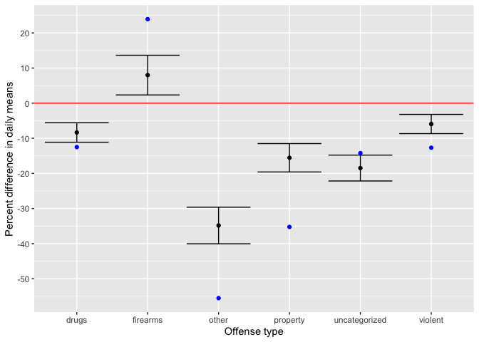

Estimating the effect of Krasner’s tenure as District Attorney on
criminal charges
================
Vitaly Lorman
12 April, 2021

## Introduction

Elected in November 2017, Philadelphia District Attorney (DA) Larry
Krasner ran on a platform whose stated top priority was ending mass
incarceration in Philadelphia (“Krasner for Da,” n.d.). A self-described
progressive DA, Krasner’s campaign promised, among other things, to stop
prosecuting “insufficient and insignificant cases”, to treat addiction
as a public safety issue, and to work to stop pursuing extreme sentences
(Austen 2018). Running for re-election in 2021, Krasner’s campaign
proclaimed a 40% decrease in the Philadelphia county jail population,
reductions in sentence length, an end to charging marijuana possession
cases, diversion of other drug possession cases to treatment, and a
shifting of resources to solving serious crimes, particularly homicides
and gun violence (“Krasner for Da: Promises Kept,” n.d.).

We carry out an observational study to determine the effect of Krasner’s
tenure and policies as Philadelphia DA on the number of charges for
different types of offenses. Our primary source of data regarding
arrests and charges comes from the Philadelphia DA’s Office (DAO), and
includes counts of arrests and charges by categories of offenses from
January 1, 2014 to present. In measuring the outcomes from cases subject
to the treatment (being charged by Krasner’s office), we restrict our
focus to the period from January 1, 2018 (the beginning of Krasner’s
term) to March 15, 2020 (prior to the start of the COVID-19 pandemic in
Philadelphia). Our control group consists of cases charged by Krasner’s
predecessor, DA Seth Williams, between January 1, 2014 and June 29,
2017. (Williams resigned from office when he pleaded guilty to bribery
on June 29, and we exclude cases charged during the six month term of
interim DA Kelley B. Hodge from our analysis.)

Both prior to and over the course of Krasner’s tenure, the crime rate
across various offenses, measured both by incidents reported by
Philadelphia and nearby county police agencies to the FBI’s Uniform
Crime Reporting (UCR) Program and by police arrests reported by the DA’s
office, has varied substantially. Since the DA’s office typically only
enters the criminal justice process after an arrest has been made, we
control for arrest counts by date across a variety of offense
categories. We argue that the most substantial potential variables that
effect charge counts do so only through their effect on the number of
arrests across various categories and that consequently, by controlling
for arrests, we produce estimates of the effect of Krasner’s tenure as
DA on the number of charges brought for various offense types.

Since the arrest counts vary between our control group (offenses charged
by DA Williams) and treatment group (offenses charged by DA Krasner), we
mitigate potential bias by employing matching as part of our
preprocessing. Our results consist of estimates of effects (together
with confidence intervals) of Krasner’s tenure as DA on the number of
charges across the following categories: violent, property, drugs,
firearms, other, and uncategorized. We adopt these groupings from those
reported by the Philadelphia DA’s Office and describe a further
refinement of which offenses comprise each category in our description
of the data below. We state our assumptions, conduct sensitivity
analyses, and conclude with a discussion of future work that could be
carried out to improve our causal estimates.

## Background on the criminal justice process in Philadelphia

The DAO typically only gets involved in a case once an arrest has been
made (by either the Philedelphia Police Department or another agency
such that jurisdiction for prosecuting the case falls under Philadelphia
County). At the first stage of this process, the DAO decides whether to
bring charges and what charges to bring. Subsequently, bail is set by a
Bail Magistrate, taking into account input from both the DA’s office and
the attorney for the defense. In some cases, instead of bringing
charges, the DAO may decide to divert a case into one of various
diversionary programs. If charges are brought, a case proceeds through
the judicial system to an outcome (verdict, guilty plea, dismissal, or
withdrawal). One of the DA’s many roles in this part of the process is
making plea offers. After an outcome, the case proceeds to sentencing.
The judge imposes a sentence with recommendations from the DAO. A single
case may have many charges, and distinct charges may have different
outcomes. Different outcomes subject to sentencing may receive different
sentences, and these sentences may be imposed concurrently or
consecutively.

In this document, we are interested in the part of the process that
involves charges (which correspond to statutes in the Pennsylvania
Criminal Law). The reason we are interested in charges is because how
and whether a cases is charged is typically the first decision made by
the DAO, and it occurs before many other actors (defense lawyers,
judges, etc.) enter the process; thus, it is also the outcome for which
we are able to study the effect of Krasner’s DAO with the fewest
potential confounders.

The publicly availably data from the DAO that we will be using in our
analysis counts only the most serious charge (subject to the most severe
sentence) for each case. To help our analysis and interpretability, we
group the possible charges into six groups based on the DAO’s grouping
of these charges on their website (“Philadelphia Dao Data Dashboard,”
n.d.). These groups, and the kinds of charges that comprise them, are as
follows:

  - **Violent charges:** Homicide, Non-fatal shooting, Rape", Robbery
    with a gun, Robbery (other), Aggravated assault with a gun,
    Aggravated assault (other), Other assaults, Sexual assaults and
    other sex offenses
  - **Property charges:** Residential burglary, Commercial burglary,
    Theft of motor vehicle tag, Theft from person, Theft from auto,
    Retail theft", Theft, Auto theft, Fraud Theft of Services,
    Embezzlement
  - **Drug charges:** Drug possession, Drug sales, DUI
  - **Firearms charges:** Illegal firearms possession
  - **Other charges:** Prostitution or sex work, Patronizing
    prostitutes, Threats of violence
  - **Uncategorized charges:** All other charges brough by the DAO that
    do not fall into the categories above.

## The data

### Source of data

The data we use in our observational study is publicly available and was
downloaded on March 22, 2021 from the District Attorney’s Office GitHub
repository (“Philadelphia Dao Github Repository,” n.d.). Specifically,
we use the data frames consisting of counts of charges and of arrests by
date, grouped by categories of offenses which are similar, but not
identical to the FBI UCR Program categories of Type I and Type II crime.

Our cleaning and preprocessing (described further in the cleaning.rmd
file) included the following steps:

  - Group offenses for charges and arrests into 6 groups (described
    above): violent, property, drugs, firearms, other, and uncategorized
    by date. Calculate daily charge and arrest total in each of these
    categories.
  - Subset the charge and arrest data frames on common values of
    date\_value and merge them by date\_value, keeping just the totals
    for each of the 6 categories.
  - Filter to include only dates prior to 2017-06-29 and after
    2018-01-01. Filter out dates after 2020-03-15 (to exclude judicial
    actions after the COVID-19 pandemic began effecting the Philadelphia
    courts). Create a binary treatment variable, assigning it to be
    FALSE for dates prior to when Krasner took office and TRUE for dates
    after. This produces the data frame “charges\_all”
  - Reshape into a long data frame with columns date\_value, type
    (arrest or chage), group (violent, property, drugs, firearms, other,
    or uncategorized) and the counts for each combination of the these.
    This data frame is called “charges\_all\_long” below.

We read in the resulting datasets.

``` r
charges_all<-read.csv("./data/charges_all.csv", row.names=1)
charges_all_long<-read.csv("./data/charges_all_long.csv", row.names=1)
charges_all$date_value<-as.Date(charges_all$date_value)
charges_all_long$date_value<-as.Date(charges_all_long$date_value)
```

## Observational study design

We set up our observational study such that a single unit consists of a
day on which criminal charges in the Philadelphia Municipal Court or
Common Pleas court could be brought between January 1, 2014 and June 29,
2017, as well as between January 1, 2018 and March 15, 2020.

### Treatment

Given a unit in our study–a day with with a collection of criminal cases
that receive potential charges–we define the treatment to be having the
cases that day charged by the DA’s office under Krasner. The control is
having the cases that day charged by the office of Krasner’s
predecessor, former DA Seth Williams.

Note that our treatment is defined somewhat narrowly, and in particular,
the treatment does not include other actions or conditions during
Krasner’s tenure as head of the DAO, even those initiated by the DAO.
Our treatment is strictly defined whether Krasner’s office charges the
cases on a given day. See the Assumptions section for further discussion
of this.

Also note that we are not studying the effect of Krasner himself but the
effect of the entire DAO under Krasner’s leadership (as opposed to the
control of the DAO under Williams’ leadership). We view the treatment as
binary (see the Discussion section for more on this).

### Outcomes

As discussed above, we group offenses into six groups (violent,
property, drugs, firearms, other, and uncategorized). Our outcomes of
interest are, for each offense type, the number of cases in which a
charge of that type was brought as the most serious charge in that case.
We define treatment effects as a difference in daily means between
treatment and control group as well as a percent change relative to the
control group daily mean.

## Covariates

The number of charges on a given day, by category, is caused by a number
of factors: the number of criminal incidents in previous weeks, the
number of arrests, policing practices such as gathering of evidence and
writing reports, criminal law (local, state, and federal), criminal
records of defendants, police department policies, and DA office policy
and practice regarding charges. The DAO is the final actor in a
complicated process.

For most of the factors that come prior to the DAO’s role in the
process, their effect on our outcomes of interest (mean daily charges by
offense category) is indirect and goes through the number of arrests.
For instance, policy department policies regarding whether to make
arrests for a given type of offense and how actively to pursue enforcing
it will only effect charges through the number of arrests made for that
type of offense. Thus, our covariates consist of daily arrest totals by
offense category. By conditioning on these, we address confounding by
many of the factors mentioned above.

### Assumptions

We assume stable unit treatment values (SUTVA); that is, we assume that
the outcomes of one unit (the count of most serious charges in cases
from one day by type) do not vary with the treatments assigned to other
units. In other words, given a day, the charge counts from that day do
not vary depending on whether the cases from a different day were by
Krasner’s office or Williams’. This assumption could be violated in the
case of reoffenders if the past criminal record of a defendant had an
effect on the sorts of charges that were brought in their case. We
assume that the effect of such instances is negligible, though a data
set that contained information on reoffenders would be necessary to test
this assumption.

We also assume that there is only one form of the treatment. This
assumption would be violated if during Krasner’s tenure as DA, the DAO
changed its policies or practices in charging certain kinds of cases.
This would be particularly of concern in the first few months of
Krasner’s tenure as DA when big changes occured in the DAO (for
instance, 31 staffers, including prosecutors, left the DAO in the first
week of Krasner’s tenure). We address this assumption further and
conduct a sensitivity analysis in the Discussion section of this
document.

We assume that unobserved confounders have negligible impact on our
estimates; that is, we make an ignorability assumption that, controlling
for observed covariates, treatment assignment is independent of the
potential outcomes. Unobserved confounders that are of potential concern
are ones that have a direct effect on charge counts rather than an
indirect one through arrest counts. These could include quality of
policy reports and evidence-gathering, prior criminal records of
defendants, defendant demographics, and local, state, or federal
policies regarding charges for certain types of offenses. The data
available to us does not contain many of these. We address how robust
our analysis is to their impact through sensitivity analyses in the
Discussion section.

Finally, we assume there is no post-treatment bias; that is, the
distribution of arrest counts does not vary with treatment assignment.
Days charged during Krasner’s tenure as DA appear to have a different
distribution of arrests from days charged prior to Krasner’s tenure as
DA. However, we recall that our definition of treatment is narrow: we
say that a unit (day) in our study has received the treatment if the
cases on that day were charged by Krasner’s office, and a unit has
received the control if the cases were charged by Williams’ office. In
particular, our definition of treatment does not include any actions by
the DAO or anyone else that effect arrests: for each individual unit,
arrest counts are pre-treatment covariates and are uneffected by the
treatment assignment. While the DAO could well have a effect on arrest
counts by, for instance, instituting a policy of not charging certain
kinds of offenses causing the police not to make arrests for those
offenses, this kind of action of the DAO does not fall within our
definition of treatment. Instead, we simply estimate the effect of
Krasner’s DAO on charging the arrests they are given. Any other effects
of the DAO on charges are outside the scope of our study.

### Outline of analysis

Our method of analysis will be to use a linear regression to estimate
the treatment effect on charge daily counts for each type regressing on
daily arrest counts by type. We analyze each type of offense separately.
In order to ensure that the arrest count covariates are similarly
distributed between the treatment and control groups, we implement
nearest-neighbor matching with calipers (further discussed below). Upon
achieving our desired balance, we fit a linear model to the matched data
to estimate the desired effects.

## Summary of trends in the data

Before we conduct our analysis, we begin by presenting some summaries of
our data. First, we show the counts for charges and arrests by type. For
this chart, we use a version of the charges\_all\_long data frame in
which the dates between 2017-06-29 and 2018-01-01 and the dates after
2020-03-25 have not been
excluded.

``` r
all_dates_long<-read.csv("./data/charges_all_long_full.csv", row.names=1)
all_dates_long$date_value<-as.Date(all_dates_long$date_value)

ggplot(data=all_dates_long, aes(x=date_value, y=value, col=type))+
  geom_point(alpha=0.02)+
  geom_smooth()+
  facet_wrap(~group, scale="free_y")+
  labs(title="Daily counts of arrests and charges by offense type", x="Date", y="Count")
```

    ## `geom_smooth()` using method = 'gam' and formula 'y ~ s(x, bs = "cs")'

<!-- -->

The above scatterplots and loess curves show trends in arrests and
charges. We see that in four of the five categories, charges track
pretty closely with arrests; the exception is uncategorized
offenses–this may be a result of the fact that it is broadly defined
and includes a variety of unrelated types of offenses that do not fit in
the other groups. We note that both charge and arrest counts for
violent, property, drug, and other offenses all saw a decrease over the
course of our timeframe, and firearm charges and arrests increased over
the same time free, with a steep increase beginning in 2020.

Next, we restrict our focus to the time periods of our control group
(2014-01-01 to 2017-06-29) and our treatment group (2018-01-01 to
2020-03-15) and show the control and treatment means for arrests and
charges by type, along with the percent in change from the control mean.

``` r
charges_all_long$treatment<-charges_all_long$date_value>="2018-01-01"
means<-charges_all_long %>%
  group_by(treatment, type, group) %>%
  summarise(mean=mean(value)) %>%
  dcast(group+type~treatment, value.var="mean")

colnames(means)[3:4]<-c("control", "treatment")
means$diff_in_means<-means$treatment-means$control
means$percent_diff_in_means<-100*means$diff_in_means/means$control
##differences in means of charges
charge_diffs<-means %>%
  filter(type=="charge") %>%
  select("group", "diff_in_means", "percent_diff_in_means")

kable(charge_diffs, caption="Differences in daily means of charge counts")
```

| group         | diff\_in\_means | percent\_diff\_in\_means |
| :------------ | --------------: | -----------------------: |
| drugs         |      \-5.202450 |               \-12.50612 |
| firearms      |        0.746456 |                 23.93089 |
| other         |      \-2.259318 |               \-55.52488 |
| property      |      \-6.715809 |               \-35.24597 |
| uncategorized |      \-1.781709 |               \-14.22467 |
| violent       |      \-3.500117 |               \-12.68519 |

Differences in daily means of charge counts

The point estimates displayed in the table show that in each offense
category except for firearms, there was a decrease in daily charge
counts from Williams’ to Krasner’s tenure as DA. This was largest, a 56
percent decrease, in the category of other offenses (which includes
prostitution and sex work related offenses, as well as threats of
violence). In the category of firearms, we see a 24 percent increase in
charges.

``` r
ggplot(data=means, aes(x=group, y=percent_diff_in_means, fill=type))+
  geom_bar(position="dodge", stat="identity")
```

<!-- -->

The barplot above shows the percent difference in means for charges and
arrests from Williams’ to Krasner’s tenure as DA. We see that for drug,
firearm, other, and property, and violent offenses, arrests and charges
both decreased, and for firearms, arrests and charges both increased.
For uncategorized offenses we see that arrests in charges moved in
opposite directions.

## Matching

Our effect estimates will come from fitting linear models, controlling
for arrest count covariates for each of our six types of offenses.
Without any preprocessing to balance the arrest count covariates in the
treatment and control groups, we might see a biased estimate due to
different levels of arrest counts by offense type in the treatment and
control groups. For instance, our scatteplots above show lower daily
arrest counts for several offense types prior to 2018. Thus, before
fitting our linear models, in this section we employ matching to account
for imbalance of covariates in our treatment and control groups
following (Daniel E. Ho and Stuart 2007). First, we plot the
distributions of mean arrest counts by type, along with a QQ plot for
each plot:

``` r
arrest_count_sum<-charges_all_long %>%
  filter(type=="arrest") %>%
  group_by(group, treatment) %>%
  summarise(mean_per_day=mean(value))

ggplot(data=arrest_count_sum, aes(x=group, y=mean_per_day, fill=treatment))+
  geom_bar(position="dodge", stat="identity")
```

<!-- -->

``` r
##Construct data with empirical quantiles for control and treatment groups

par(mfrow=c(2,3))
for (g in unique(charges_all_long$group))
{
  x<-filter(charges_all_long, type=="arrest", group==g, !treatment)$value
  y<-filter(charges_all_long, type=="arrest", group==g, treatment)$value
  qqplot(x, y, main=g,
  xlab="Control",
  ylab="Treatment",
  xlim=c(min(x, y), max(x, y)),
  ylim=c(min(x, y), max(x, y)))
  abline(0,1)
}
```

<!-- -->

``` r
#mtext("QQ plots for mean daily arrest counts by offense group", outer=TRUE,side=3,line=0, cex=1.5)
```

We see imbalance for some of the arrest types, particularly property,
drugs, and other.

To address this imbalance, we implement matching on propensity scores.
Following Daniel E. Ho and Stuart (2007) and appealing to the
“propensity score tautology”, our sole concern is achieving balance on
the covariates, and so whatever matching method we implement that yields
our desired level of balance will do the job. We experimented with a
variety of matching methods (further detailed in the “Matching.Rmd”
document), and we observed a tradeoff between sample sizes of matched
data and balance. For example, using subclassification matching with 6
classes, we were able to get good balance, but at the expense of one of
the subclasses having as few as 19 control units (having started with
1275 control units).

We settled on variable ratio nearest-neighbor matching with calipers of
size 0.1 (standard deviations of the propensity scores within which to
draw matches). Since the higher end of the propensity score distribution
was overrepresented in the treatment group, the price we paid for our
balance was about 31% of our treated observations going unmatched. The
Discussion section contains further analysis of this methodological
choice, and the supplementary “matching.Rmd” file contains summaries for
the balance we achieved using this matching method, along with an
exploration of other matching methods.

Here we print a few plots that demonstrate the covariate balance our
matching
achieves.

``` r
mcal1.out<-matchit(treatment~arrests_violent+arrests_property+arrests_drugs+arrests_other+arrests_firearms+arrests_uncategorized, data=charges_all, method="nearest", caliper=0.1, ratio=1275/804, min.controls=1, max.controls=3)
scal1.out <- summary(mcal1.out, standardize = TRUE)
#scal1.out
plot(scal1.out)
```

<!-- -->

The Love plot above compares the standardized mean difference measure of
balance for each covariate in the matched data to all data. The vertical
dashed lines are drawn within .1 standardized mean difference units of
zero, and we see that for each covariate, the standardized mean
differences between treatment and control covariates all fall within
this margin of
zero.

``` r
plot(mcal1.out,  type = "jitter", interactive = FALSE)
```

<!-- -->

``` r
plot(mcal1.out,  type = "hist")
```

<!-- -->

``` r
plot(mcal1.out, type="qq")
```

<!-- --><!-- -->

``` r
matched_data2<-match.data(mcal1.out)
matched_data2$treatment<-as.numeric(matched_data2$treatment)
```

The jitter plot above shows that our matching method required dropping
treatment units from the high end of the propensity score distribution
and control units from the low end of the propensity score distrbution.
The histogram shows very similar propensity score distributions between
treatment and control groups in the matched data, and the QQ plots show
that matching has resulted in similar distributions not just for
propensity scores, but for arrest counts for each offense type.

## Fitting linear models

Now that we have achieved balance between treatment and control groups,
we fit a linear model to the data. For each outcome of interest (charge
counts for each of the 6 offense groups), we regress on the binary
treatment variable and the arrest counts for each of the 6 offense
groups.

We summarize each linear model
below.

``` r
lm_violent<-lm(charges_violent~treatment+arrests_violent+arrests_property+arrests_drugs+arrests_firearms+arrests_other+arrests_uncategorized, data=matched_data2)
#x.out <- setx(z.out, data = match.data(m.out), fn = NULL, cond = TRUE)
#s.out <- sim(z.out, x = x.out)
summary(lm_violent)
```

    ## 
    ## Call:
    ## lm(formula = charges_violent ~ treatment + arrests_violent + 
    ##     arrests_property + arrests_drugs + arrests_firearms + arrests_other + 
    ##     arrests_uncategorized, data = matched_data2)
    ## 
    ## Residuals:
    ##     Min      1Q  Median      3Q     Max 
    ## -39.161  -4.617  -0.551   4.076  67.559 
    ## 
    ## Coefficients:
    ##                       Estimate Std. Error t value Pr(>|t|)    
    ## (Intercept)            9.59352    0.85554  11.213  < 2e-16 ***
    ## treatment             -1.63691    0.38492  -4.253 2.25e-05 ***
    ## arrests_violent        0.53245    0.02490  21.384  < 2e-16 ***
    ## arrests_property       0.04131    0.03019   1.368  0.17148    
    ## arrests_drugs          0.02985    0.01287   2.320  0.02049 *  
    ## arrests_firearms      -0.09193    0.08413  -1.093  0.27469    
    ## arrests_other          0.15997    0.05885   2.718  0.00664 ** 
    ## arrests_uncategorized  0.06421    0.02862   2.243  0.02502 *  
    ## ---
    ## Signif. codes:  0 '***' 0.001 '**' 0.01 '*' 0.05 '.' 0.1 ' ' 1
    ## 
    ## Residual standard error: 6.996 on 1463 degrees of freedom
    ## Multiple R-squared:  0.3186, Adjusted R-squared:  0.3153 
    ## F-statistic: 97.71 on 7 and 1463 DF,  p-value: < 2.2e-16

``` r
lm_property<-lm(charges_property~treatment+arrests_violent+arrests_property+arrests_drugs+arrests_firearms+arrests_other+arrests_uncategorized, data=matched_data2)
#x.out <- setx(z.out, data = match.data(m.out), fn = NULL, cond = TRUE)
#s.out <- sim(z.out, x = x.out)
summary(lm_property)
```

    ## 
    ## Call:
    ## lm(formula = charges_property ~ treatment + arrests_violent + 
    ##     arrests_property + arrests_drugs + arrests_firearms + arrests_other + 
    ##     arrests_uncategorized, data = matched_data2)
    ## 
    ## Residuals:
    ##     Min      1Q  Median      3Q     Max 
    ## -24.595  -3.596  -0.860   2.493 128.374 
    ## 
    ## Coefficients:
    ##                        Estimate Std. Error t value Pr(>|t|)    
    ## (Intercept)            7.406485   0.873164   8.482  < 2e-16 ***
    ## treatment             -2.962303   0.392848  -7.541 8.17e-14 ***
    ## arrests_violent        0.028006   0.025413   1.102 0.270616    
    ## arrests_property       0.511128   0.030813  16.588  < 2e-16 ***
    ## arrests_drugs          0.008982   0.013132   0.684 0.494073    
    ## arrests_firearms       0.085210   0.085862   0.992 0.321166    
    ## arrests_other          0.207150   0.060063   3.449 0.000579 ***
    ## arrests_uncategorized  0.007472   0.029210   0.256 0.798141    
    ## ---
    ## Signif. codes:  0 '***' 0.001 '**' 0.01 '*' 0.05 '.' 0.1 ' ' 1
    ## 
    ## Residual standard error: 7.14 on 1463 degrees of freedom
    ## Multiple R-squared:  0.2496, Adjusted R-squared:  0.246 
    ## F-statistic: 69.52 on 7 and 1463 DF,  p-value: < 2.2e-16

``` r
lm_drugs<-lm(charges_drugs~treatment+arrests_violent+arrests_property+arrests_drugs+arrests_firearms+arrests_other+arrests_uncategorized, data=matched_data2)
#x.out <- setx(z.out, data = match.data(m.out), fn = NULL, cond = TRUE)
#s.out <- sim(z.out, x = x.out)
summary(lm_drugs)
```

    ## 
    ## Call:
    ## lm(formula = charges_drugs ~ treatment + arrests_violent + arrests_property + 
    ##     arrests_drugs + arrests_firearms + arrests_other + arrests_uncategorized, 
    ##     data = matched_data2)
    ## 
    ## Residuals:
    ##     Min      1Q  Median      3Q     Max 
    ## -52.187  -6.793  -0.513   6.180  81.278 
    ## 
    ## Coefficients:
    ##                       Estimate Std. Error t value Pr(>|t|)    
    ## (Intercept)           10.60379    1.30873   8.102 1.13e-15 ***
    ## treatment             -3.47140    0.58882  -5.896 4.63e-09 ***
    ## arrests_violent       -0.10307    0.03809  -2.706  0.00689 ** 
    ## arrests_property      -0.13375    0.04618  -2.896  0.00383 ** 
    ## arrests_drugs          0.81671    0.01968  41.494  < 2e-16 ***
    ## arrests_firearms       0.07805    0.12869   0.607  0.54427    
    ## arrests_other         -0.07792    0.09002  -0.866  0.38690    
    ## arrests_uncategorized  0.07685    0.04378   1.755  0.07941 .  
    ## ---
    ## Signif. codes:  0 '***' 0.001 '**' 0.01 '*' 0.05 '.' 0.1 ' ' 1
    ## 
    ## Residual standard error: 10.7 on 1463 degrees of freedom
    ## Multiple R-squared:  0.6365, Adjusted R-squared:  0.6348 
    ## F-statistic:   366 on 7 and 1463 DF,  p-value: < 2.2e-16

``` r
lm_firearms<-lm(charges_firearms~treatment+arrests_violent+arrests_property+arrests_drugs+arrests_firearms+arrests_other+arrests_uncategorized, data=matched_data2)
#x.out <- setx(z.out, data = match.data(m.out), fn = NULL, cond = TRUE)
#s.out <- sim(z.out, x = x.out)
summary(lm_firearms)
```

    ## 
    ## Call:
    ## lm(formula = charges_firearms ~ treatment + arrests_violent + 
    ##     arrests_property + arrests_drugs + arrests_firearms + arrests_other + 
    ##     arrests_uncategorized, data = matched_data2)
    ## 
    ## Residuals:
    ##     Min      1Q  Median      3Q     Max 
    ## -9.7864 -1.0336 -0.1855  0.8962 14.3359 
    ## 
    ## Coefficients:
    ##                         Estimate Std. Error t value Pr(>|t|)    
    ## (Intercept)            0.5660635  0.1998225   2.833  0.00468 ** 
    ## treatment              0.2494747  0.0899027   2.775  0.00559 ** 
    ## arrests_violent       -0.0007096  0.0058156  -0.122  0.90290    
    ## arrests_property      -0.0080548  0.0070515  -1.142  0.25352    
    ## arrests_drugs          0.0164700  0.0030052   5.480 4.99e-08 ***
    ## arrests_firearms       0.6403571  0.0196494  32.589  < 2e-16 ***
    ## arrests_other         -0.0121206  0.0137454  -0.882  0.37803    
    ## arrests_uncategorized -0.0001594  0.0066847  -0.024  0.98098    
    ## ---
    ## Signif. codes:  0 '***' 0.001 '**' 0.01 '*' 0.05 '.' 0.1 ' ' 1
    ## 
    ## Residual standard error: 1.634 on 1463 degrees of freedom
    ## Multiple R-squared:  0.4761, Adjusted R-squared:  0.4735 
    ## F-statistic: 189.9 on 7 and 1463 DF,  p-value: < 2.2e-16

``` r
lm_other<-lm(charges_other~treatment+arrests_violent+arrests_property+arrests_drugs+arrests_firearms+arrests_other+arrests_uncategorized, data=matched_data2)
#x.out <- setx(z.out, data = match.data(m.out), fn = NULL, cond = TRUE)
#s.out <- sim(z.out, x = x.out)
summary(lm_other)
```

    ## 
    ## Call:
    ## lm(formula = charges_other ~ treatment + arrests_violent + arrests_property + 
    ##     arrests_drugs + arrests_firearms + arrests_other + arrests_uncategorized, 
    ##     data = matched_data2)
    ## 
    ## Residuals:
    ##      Min       1Q   Median       3Q      Max 
    ## -11.9232  -1.0897  -0.0776   0.8453  11.2408 
    ## 
    ## Coefficients:
    ##                         Estimate Std. Error t value Pr(>|t|)    
    ## (Intercept)            8.144e-01  2.401e-01   3.392 0.000713 ***
    ## treatment             -1.417e+00  1.080e-01 -13.118  < 2e-16 ***
    ## arrests_violent        5.569e-03  6.989e-03   0.797 0.425638    
    ## arrests_property       4.930e-05  8.474e-03   0.006 0.995359    
    ## arrests_drugs          8.846e-03  3.611e-03   2.450 0.014420 *  
    ## arrests_firearms       6.420e-03  2.361e-02   0.272 0.785748    
    ## arrests_other          6.488e-01  1.652e-02  39.279  < 2e-16 ***
    ## arrests_uncategorized -8.317e-05  8.033e-03  -0.010 0.991741    
    ## ---
    ## Signif. codes:  0 '***' 0.001 '**' 0.01 '*' 0.05 '.' 0.1 ' ' 1
    ## 
    ## Residual standard error: 1.964 on 1463 degrees of freedom
    ## Multiple R-squared:  0.6216, Adjusted R-squared:  0.6198 
    ## F-statistic: 343.3 on 7 and 1463 DF,  p-value: < 2.2e-16

``` r
lm_uncategorized<-lm(charges_uncategorized~treatment+arrests_violent+arrests_property+arrests_drugs+arrests_firearms+arrests_other+arrests_uncategorized, data=matched_data2)
#x.out <- setx(z.out, data = match.data(m.out), fn = NULL, cond = TRUE)
#s.out <- sim(z.out, x = x.out)
summary(lm_uncategorized)
```

    ## 
    ## Call:
    ## lm(formula = charges_uncategorized ~ treatment + arrests_violent + 
    ##     arrests_property + arrests_drugs + arrests_firearms + arrests_other + 
    ##     arrests_uncategorized, data = matched_data2)
    ## 
    ## Residuals:
    ##      Min       1Q   Median       3Q      Max 
    ## -12.3520  -2.7695  -0.1723   2.4571  25.2815 
    ## 
    ## Coefficients:
    ##                        Estimate Std. Error t value Pr(>|t|)    
    ## (Intercept)            3.916078   0.522604   7.493 1.16e-13 ***
    ## treatment             -2.314187   0.235126  -9.842  < 2e-16 ***
    ## arrests_violent        0.009877   0.015210   0.649   0.5162    
    ## arrests_property      -0.033817   0.018442  -1.834   0.0669 .  
    ## arrests_drugs          0.015351   0.007860   1.953   0.0510 .  
    ## arrests_firearms       0.106368   0.051390   2.070   0.0386 *  
    ## arrests_other         -0.020614   0.035949  -0.573   0.5664    
    ## arrests_uncategorized  0.322362   0.017483  18.439  < 2e-16 ***
    ## ---
    ## Signif. codes:  0 '***' 0.001 '**' 0.01 '*' 0.05 '.' 0.1 ' ' 1
    ## 
    ## Residual standard error: 4.273 on 1463 degrees of freedom
    ## Multiple R-squared:  0.2872, Adjusted R-squared:  0.2838 
    ## F-statistic: 84.22 on 7 and 1463 DF,  p-value: < 2.2e-16

## Results: summary of estimated effects

In the table below, we summarise our estimated effect for each offense
group. We report the mean effect as well as the 95% confidence interval
in both absolute counts and as percent change relative to the control
mean.

``` r
charge_type<-c("violent", "property", "drugs", "firearms", "other", "uncategorized")
effect_sum<-as.data.frame(charge_type)
effect_sum[,"treatment"]<-
  rbind(lm_violent$coefficients["treatment"],
    lm_property$coefficients["treatment"],
    lm_drugs$coefficients["treatment"],
    lm_firearms$coefficients["treatment"],
    lm_other$coefficients["treatment"],
    lm_uncategorized$coefficients["treatment"])
                                
effect_sum<-cbind(effect_sum,
  rbind(confint(lm_violent)["treatment",],
    confint(lm_property)["treatment",],
    confint(lm_drugs)["treatment",],
    confint(lm_firearms)["treatment",],
    confint(lm_other)["treatment",],
    confint(lm_uncategorized)["treatment",]))

colnames(effect_sum)[3:4]<-c("confmin", "confmax")

#effect_sum[,c("treatment", "confmin", "confmax")]<-
#  round(effect_sum[,c("treatment", "confmin", "confmax")],2)


#effect_sum[,"95% confint"]<-paste("(", effect_sum$confmin, ",", effect_sum$confmax, ")")

effect_sum<-cbind(effect_sum,
                  100*effect_sum[,c("treatment","confmin", "confmax")]/
                    filter(means, type=="charge")[c(6, 4, 1, 2, 3, 5),"control"])
colnames(effect_sum)[5:7]<-c("perc_treatment", "perc_confmin", "perc_confmax")
effect_table<-as.data.frame(effect_sum[,1])
#effect_table[,2:3]<-round(effect_table[,2:3],2)
colnames(effect_table)<-c("Charge type")
effect_table[,"Estimated difference"]<-
  paste(round(effect_sum[,2],2), ", (", 
        round(effect_sum$confmin,2), ",",
        round(effect_sum$confmax,2), ")")
effect_table[,"Estimated % difference"]<-
  paste(round(effect_sum[,5],2), ", (", 
        round(effect_sum$perc_confmin,2), ",",
        round(effect_sum$perc_confmax,2), ")")
effect_table
```

    ##     Charge type      Estimated difference       Estimated % difference
    ## 1       violent -1.64 , ( -2.39 , -0.88 )     -5.93 , ( -8.67 , -3.2 )
    ## 2      property -2.96 , ( -3.73 , -2.19 )  -15.55 , ( -19.59 , -11.5 )
    ## 3         drugs -3.47 , ( -4.63 , -2.32 )   -8.34 , ( -11.12 , -5.57 )
    ## 4      firearms    0.25 , ( 0.07 , 0.43 )         8 , ( 2.34 , 13.65 )
    ## 5         other -1.42 , ( -1.63 , -1.21 ) -34.83 , ( -40.04 , -29.62 )
    ## 6 uncategorized -2.31 , ( -2.78 , -1.85 ) -18.48 , ( -22.16 , -14.79 )

``` r
kable(effect_table, caption="Effect estimates and 95% confidence intervals")
```

| Charge type   | Estimated difference       | Estimated % difference        |
| :------------ | :------------------------- | :---------------------------- |
| violent       | \-1.64 , ( -2.39 , -0.88 ) | \-5.93 , ( -8.67 , -3.2 )     |
| property      | \-2.96 , ( -3.73 , -2.19 ) | \-15.55 , ( -19.59 , -11.5 )  |
| drugs         | \-3.47 , ( -4.63 , -2.32 ) | \-8.34 , ( -11.12 , -5.57 )   |
| firearms      | 0.25 , ( 0.07 , 0.43 )     | 8 , ( 2.34 , 13.65 )          |
| other         | \-1.42 , ( -1.63 , -1.21 ) | \-34.83 , ( -40.04 , -29.62 ) |
| uncategorized | \-2.31 , ( -2.78 , -1.85 ) | \-18.48 , ( -22.16 , -14.79 ) |

Effect estimates and 95% confidence intervals

The plot below shows our estimated effects (as percent differences in
means) together with 95% confidence intervals. The blue dots denote the
raw differences in means between the treatment and control groups for
comparison.

``` r
effect_plot<-ggplot()+
  geom_errorbar(data=effect_sum, mapping=aes(x=charge_type, ymin=perc_confmin, ymax=perc_confmax))+
  geom_point(data=effect_sum, aes(x=charge_type, y=perc_treatment))+
  scale_y_continuous(breaks=seq(-60,40,10))+
  geom_point(data=charge_diffs, aes(x=group, y=percent_diff_in_means), color="blue")+
  geom_hline(yintercept=0, color="red")+
  xlab("Offense type")+
  ylab("Percent difference in daily means")

effect_plot
```

<!-- -->

In summary, our mean effect estimates are as follows:

  - ***Violent offenses:*** a `5.9`% decrease in charges.

  - ***Property offenses:*** a 15.5% decrease in charges.

  - ***Drug offenses:*** a 8.3% decrease in charges.

  - ***Firearms offenses:*** a 8% increase in charges.

  - ***Other offenses:*** a 34.8% decrease in charges.

  - ***Uncategorized offenses:*** a 18.5% decrease in charges.

In all six categories, we have statistically significant evidence of a
nonzero treatment effect (a decrease in all categories except firearms
offenses).

Comparing to the raw differences in means (prior to controlling for
arrest counts), we observe that none of these estimates fall within our
95% confidence intervals. For violent, property, drug, and other
offenses, we find that our estimated effect is a smaller decrease than
the percent change in means. In the case of uncategorized offenses, our
estimated effect is a larger decrease than the difference in means.
Finally, in the case of firearm offenses, the effect we estimate is that
of a substantially smaller increase (about 8%) than the simple
difference in means (about 24%).

## Discussion

An analysis of Krasner’s office’s effect on charges that does not take
into account numbers of arrests is open to substantial confounding. We
find that after controlling for arrest counts, the effect of being
charged by Krasner’s office was a decrease in charges in every category
of offense except for firearms. For firearms offenses, we find that
after accounting for arrests, which saw during Krasner’s tenure as DA a
25% increase from the pre-Krasner mean, Krasner’s office had the effect
of a 8% increase in charges.

Next, we discuss potential limitations of our study and examine how
robust our study is to violations of our assumptions and model choices
through some sensitivity analyses.

We recall that our estimates are not the entirety of Krasner’s DAO’s
effect on charges. For instance, a decision early in Krasner’s tenure to
drop all marijuana possession charges may have had an effect on
Philadelphia Police Department policy on whether to make arrests in
cases of marijuana possession. Thus, by its effect on arrests, Krasner’s
DAO may have had an additional effect on the reduction in charges for
drug offenses. However, any such effect is not included in our
estimate–the above estimates only apply to what effect Krasner’s
office had in charging the arrests they were given as compared to
Williams’ DAO.

Our assumption that there was only one form of the treatment is almost
certainly not entirely accurate: changes to charging policy through
Krasner’s tenure may well mean that the same day being charged by
Krasner’s DAO at one time could have different outcomes from being
charged during a different time. In particular, Krasner’s first several
months as DA involved changes to the DAO, its policies, and its
personnel, including large turnover in staff and prosecutors. We re-run
our analysis, excluding the first 3 months of Krasner’s tenure to see if
it changes our conclusions:

``` r
charges_res<-charges_all[charges_all$date_value<="2017-06-29" |
                              charges_all$date_value>="2018-03-01",]
n_treatment<-nrow(charges_res[charges_res$treatment,])
n_control<-nrow(charges_all)-n_treatment

m_res.out<-matchit(treatment~arrests_violent+arrests_property+arrests_drugs+arrests_other+arrests_firearms+arrests_uncategorized, data=charges_res, method="nearest", caliper=0.1, ratio=1.7, min.controls=1, max.controls=3)

matched_data_res<-match.data(m_res.out)
matched_data_res$treatment<-as.numeric(matched_data_res$treatment)


lm_violent_res.out<-lm(charges_violent~treatment+arrests_violent+arrests_property+arrests_drugs+arrests_firearms+arrests_other+arrests_uncategorized, data=matched_data_res)
lm_property_res.out<-lm(charges_property~treatment+arrests_violent+arrests_property+arrests_drugs+arrests_firearms+arrests_other+arrests_uncategorized, data=matched_data_res)
lm_drugs_res.out<-lm(charges_drugs~treatment+arrests_violent+arrests_property+arrests_drugs+arrests_firearms+arrests_other+arrests_uncategorized, data=matched_data_res)
lm_firearms_res.out<-lm(charges_firearms~treatment+arrests_violent+arrests_property+arrests_drugs+arrests_firearms+arrests_other+arrests_uncategorized, data=matched_data_res)
lm_other_res.out<-lm(charges_other~treatment+arrests_violent+arrests_property+arrests_drugs+arrests_firearms+arrests_other+arrests_uncategorized, data=matched_data_res)
lm_uncategorized_res.out<-lm(charges_uncategorized~treatment+arrests_violent+arrests_property+arrests_drugs+arrests_firearms+arrests_other+arrests_uncategorized, data=matched_data_res)

effect_sum[,"treatment_effect_res"]<-
  rbind(lm_violent_res.out$coefficients["treatment"],
    lm_property_res.out$coefficients["treatment"],
    lm_drugs_res.out$coefficients["treatment"],
    lm_firearms_res.out$coefficients["treatment"],
    lm_other_res.out$coefficients["treatment"],
    lm_uncategorized_res.out$coefficients["treatment"])
                                
effect_sum<-cbind(effect_sum,
  rbind(confint(lm_violent_res.out)["treatment",],
    confint(lm_property_res.out)["treatment",],
    confint(lm_drugs_res.out)["treatment",],
    confint(lm_firearms_res.out)["treatment",],
    confint(lm_other_res.out)["treatment",],
    confint(lm_uncategorized_res.out)["treatment",]))

colnames(effect_sum)[8:10]<-c("treatment_res","confmin_res", "confmax_res")

select(effect_sum, "treatment", "confmin", "confmax", "treatment_res", "confmin_res", "confmax_res")
```

    ##    treatment     confmin    confmax  treatment confmin_res confmax_res
    ## 1 -1.6369071 -2.39196061 -0.8818535 -1.3740631  -2.1483651  -0.5997612
    ## 2 -2.9623028 -3.73290788 -2.1916976 -3.4175600  -4.1851122  -2.6500078
    ## 3 -3.4713957 -4.62640890 -2.3163826 -3.5604107  -4.7524316  -2.3683898
    ## 4  0.2494747  0.07312272  0.4258266  0.2997844   0.1205309   0.4790379
    ## 5 -1.4172731 -1.62920024 -1.2053459 -1.4929295  -1.7301010  -1.2557580
    ## 6 -2.3141866 -2.77540677 -1.8529664 -2.3026594  -2.7847629  -1.8205558

While we see some small changes in our estimates, our confidence
intervals still do not contain zero, and we come to the same broad
conclusions as before.

Next, we consider possible bias in our estimates introduced by our
matching procedure, particularly the fact that we discarded treatment
units in forming our matched data. First, we note that achieving good
balance on covariates reduces interpolation bias (as defined in King,
King, and Zeng (2006)). Since we are calculating the average treatment
effect (ATE) and not the average treatment effect on the treated (ATT),
we not need to worry that dropping treated units changes the population
for which we make our estimates. However, by dropping both treatment and
control units, there is potential that we introduce extrapoation bias
into the study.

First, we argue this is not a concern in our study. The reason is that
we assume that the DAO’s decisions to charge individual cases are
independent of the volume or distribution of the other cases (arrests)
from that day. Consequently, we argue that we can extrapolate effects
computed from days with a very distribution of types and counts or
arrests to days with very different distributions and counts of arrests.
Consequently, discarding some of our treatment units with propensity
scores that are harder to match should not introduce substantial
extrapolation bias as the units were discarded on the basis of arrest
covariates (via propensity scores) and not on the basis of outcomes.

However, to check that our analysis is robust to changes in the matching
mechanism, we report the results of several other matching methods that
were employed. The code for these is contained in the appendix.

To assess our assumption of ignorability, we employ a sensitivity
analysis method developed by Blackwell Blackwell (2014). We measure
sensitivity to one-sided selection bias: that is, the amount of an
unmeasured confounder could increase (or decrease) charge counts,
controlling for arrests, in the treatment group (cases post 2018)
compared to the control group (pre-2018). Such confounding would exist
if, for instance, quality of police reports or prior records of
arrestees changed between or during the two DA administrations, making
arrestees more or less susceptible to charges. Following Blackwell’s
method, for each amount of confounding (alpha), we assess whether this
would reverse our conclusion that having Krasner’s DAO charge cases
results in a statistically significant change in number of charge in
each category, controlling for arrests. We report the amount of
confounding (measured in the original units of numbers of charges) that
would be needed to reverse our conclusion.

``` r
model.t<-glm(treatment~arrests_violent+arrests_property+
               arrests_drugs+arrests_firearms+arrests_other+
               arrests_uncategorized, data=matched_data2, 
             family=binomial())

alpha_violent_1=seq(-8, 2, by=0.01)
sens_violent_1 <- causalsens(lm_violent, model.t, 
                      ~ arrests_violent+arrests_property+arrests_drugs+
                        arrests_firearms+arrests_other+arrests_uncategorized,
                      data = matched_data2,  confound = one.sided, alpha=alpha_violent_1)
alpha_property_1=seq(-6, 0, by=0.01)
sens_property_1 <- causalsens(lm_property, model.t, 
                      ~ arrests_violent+arrests_property+arrests_drugs+
                        arrests_firearms+arrests_other+arrests_uncategorized,
                      data = matched_data2,  confound = one.sided, alpha=alpha_property_1)
alpha_drugs_1=seq(-10, 0, by=0.01)
sens_drugs_1<-causalsens(lm_drugs, model.t, 
                      ~ arrests_violent+arrests_property+arrests_drugs+
                        arrests_firearms+arrests_other+arrests_uncategorized,
                      data = matched_data2,  confound = one.sided, alpha=alpha_drugs_1)
alpha_firearms_1=seq(-0.5, 0.5, by=0.01)
sens_firearms_1<-causalsens(lm_firearms, model.t, 
                      ~ arrests_violent+arrests_property+arrests_drugs+
                        arrests_firearms+arrests_other+arrests_uncategorized,
                      data = matched_data2,  confound = one.sided, alpha=alpha_firearms_1)
alpha_other_1=seq(-4, 0, by=0.01)
sens_other_1<-causalsens(lm_other, model.t, 
                      ~ arrests_violent+arrests_property+arrests_drugs+
                        arrests_firearms+arrests_other+arrests_uncategorized,
                      data = matched_data2,  confound = one.sided, alpha=alpha_other_1)
alpha_uncategorized_1=seq(-4, 0, by=0.01)
sens_uncategorized_1<-causalsens(lm_uncategorized, model.t, 
                      ~ arrests_violent+arrests_property+arrests_drugs+
                        arrests_firearms+arrests_other+arrests_uncategorized,
                      data = matched_data2,  confound = one.sided, alpha=alpha_uncategorized_1)

#a function to extract the value of alpha (amoung of selection bias=amount of confounding) 
#and the R-squared at which our causal estimates would lose statistical significance.
cnf_val<-function(X)
{
  ind<-min(which(X$lower<0))
  c(X[ind, "alpha"], X[ind, "rsqs"])
}
confounding_values<-as.data.frame(
  rbind(
    cnf_val(sens_violent_1$sens),
    cnf_val(sens_property_1$sens),
    cnf_val(sens_drugs_1$sens),
    cnf_val(sens_firearms_1$sens),
    cnf_val(sens_other_1$sens),
    cnf_val(sens_uncategorized_1$sens)
  )
)

types<-c("violent", "property", "drugs", "firearms", "other", "uncategorized")
row.names(confounding_values)<-types
colnames(confounding_values)<-c("alpha", "rsqs")

control_means<-filter(means, type=="charge")[, c("group", "control")][c(6, 4, 1, 2, 3, 5),]
confounding_values[,"percent"]<-confounding_values$alpha/control_means$control


par(mfrow=c(2, 3))
plot(sens_violent_1, type = "raw", bty = "n", main="Violent (one-sided)")
plot(sens_property_1, type = "raw", bty = "n", main="Property (one-sided)")
plot(sens_drugs_1, type = "raw", bty = "n", main="Drugs (one-sided)")
plot(sens_firearms_1, type = "raw", bty = "n", main="Firearms (one-sided)")
plot(sens_other_1, type = "raw", bty = "n", main="Other (one-sided)")
plot(sens_uncategorized_1, type = "raw", bty = "n", main="Uncategorized (one-sided)")
```

<!-- -->

The results of our sensitivity analysis are as follows:

  - ***Violent offenses:*** An unobserved covariate would have to on
    average result in 2.4 (a 8.7 decrease from control) fewer charges
    per day between cases tried pre and post Krasner to reverse our
    conclusion that Krasner’s DAO caused a statistically significant
    decrease in violent charges controlling for arrests.

  - ***Property offenses:*** An unobserved covariate would have to on
    average result in 3.74 (a 19.6 decrease from control) fewer charges
    per day between cases tried pre and post Krasner to reverse our
    conclusion that Krasner’s DAO caused a statistically significant
    decrease in property charges controlling for arrests.

  - ***Drug offenses:*** An unobserved covariate would have to on
    average result in 4.64 (a 11.2 decrease from control) fewer charges
    per day between cases tried pre and post Krasner to reverse our
    conclusion that Krasner’s DAO caused a statistically significant
    decrease in drug charges controlling for arrests.

  - ***Firearms offenses:*** An unobserved covariate would have to on
    average result in 0.08 (a 2.6 increase from control) more charges
    per day between cases tried pre and post Krasner to reverse our
    conclusion that Krasner’s DAO caused a statistically significant
    increase in firearms charges controlling for arrests.

  - ***Other offenses:*** An unobserved covariate would have to on
    average result in 1.63 (a 40.1 decrease from control) fewer charges
    per day between cases tried pre and post Krasner to reverse our
    conclusion that Krasner’s DAO caused a statistically significant
    decrease in other charges controlling for arrests.

  - ***Uncategorized offenses:*** An unobserved covariate would have to
    on average result in 2.78 (a 22.2 decrease from control) fewer
    charges per day between cases tried pre and post Krasner to reverse
    our conclusion that Krasner’s DAO caused a statistically significant
    decrease in uncategorized charges controlling for arrests.

Based on our sensitivity analysis, we conclude that our treatment effect
estimates for property, other, and uncategorized offenses are robust to
effects of potential unobserved covariates and our conclusions for drug
and violent offenses are moderately so. However, our conclusion that
Krasner’s office caused an increase in charges for firearms offenses
controlling for arrests is quite sensitive to the effects of potential
unobserved covariates.

In conclusion, our analysis shows that Krasner’s DAO had a statistically
significant effect on the number of cases charged for each offense type,
a decrease in 5 of 6 categories. None of these estimates are as large in
magnitude as simple point estimates (prior to controlling for arrests)
would suggest. The largest estimated effect we observe is a 34.8%
decrease in charges for other offenses (sex work related offenses and
threats of violence), followed by a 15.6 percent decrease in charges for
property related offenses. For firearms offenses, despite the fact that
arrests increased steeply during roughly the same time frame as charges,
we find that the effect of Krasner’s DAO was an 8% increase in charges.
However, our sensitivity analysis suggests that an unobserved covariate
would only have to be responsible for a small change in charge counts to
reverse this conclusion.

## Future Directions

Our sensitivity analysis above suggests that the extent to which our
ignorability assumption holds could reverse our conclusion, particularly
that Krasner’s DAO was responsible for an increase in firearms charges.
If we had more data on potential factors that effect charges such as
prior criminal records of defendants, changes to state laws and policies
regarding how arrests are charged, and quality of police reports and
data provided to the DAO, we would be better able to evaluate this
assumption.

Accounting for the longitudinal nature of our data could provide more
accurate effect estimates. For instance, an interrupted time series
model could be well suited for this problem. One challenge is the lack
of a control population post 2018 (after Krasner took office). Future
work in this direction could proceed by finding charge and arrest data
from a comparison population in a different city which did not
experience a change in DA during our time-frame and use this in an
interrupted time series framework.

Finally, beyond charges, the DAO plays a substantial role later in the
criminal justice process, particularly in the bail process, diversionary
programs, and sentencing. It would be interesting to implement some of
these methods (controlling for the actions of other actors, such as
judges, in the process) to estimate the effects of Krasner’s DAO in
these areas. Such studies would create a more comprehensive picture of
Krasner’s DAO’s effect on the criminal justice system in Philadelphia.

## Bibliography

<div id="refs" class="references">

<div id="ref-Austen">

Austen, Ben. 2018. “In Philadelphia, a Progressive D.a. Tests the Power
— and Learns the Limits — of His Office.” *New York Times*.
<https://www.nytimes.com/2018/10/30/magazine/larry-krasner-philadelphia-district-attorney-progressive.html>.

</div>

<div id="ref-Blackwell">

Blackwell, Matthew. 2014. “A Selection Bias Approach to Sensitivity
Analysis for Causal Effects.” *Political Analysis* 22 (2): 169–82.

</div>

<div id="ref-HIKS">

Daniel E. Ho, Gary King, Kosuke Imai, and Elizabeth A. Stuart. 2007.
“Matching as Nonparametric Preprocessing for Reducing Model Dependence
in Parametric Causal Inference.” *Political Analysis* 15 (199).

</div>

<div id="ref-KZ">

King, Gary, Gary King, and Langche Zeng. 2006. “The Dangers of Extreme
Counterfactuals.” *Political Analysis* 14 (2): 131–59.

</div>

<div id="ref-Krasner1">

“Krasner for Da.” n.d.
<https://web.archive.org/web/20171013182105/https://krasnerforda.com/>.

</div>

<div id="ref-Krasner2">

“Krasner for Da: Promises Kept.” n.d.
<https://krasnerforda.com/promises-kept>.

</div>

<div id="ref-DAO">

“Philadelphia Dao Data Dashboard.” n.d. <https://data.philadao.com/>.

</div>

<div id="ref-DAOdata">

“Philadelphia Dao Github Repository.” n.d.
<https://github.com/phillydao/phillydao-public-data/tree/master/docs/data>.

</div>

</div>
