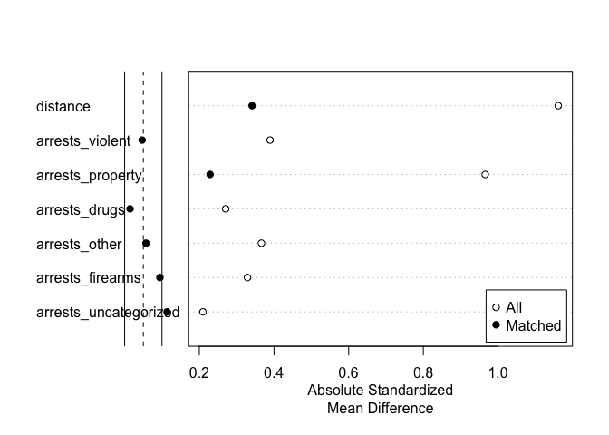

Supplementary document on matching methods
================
Vitaly Lorman
3/25/2021

## Introduction

This document is a supplement to the analysis and write-up in
[main.md](main.md), which estimates the effects of Larry Krasner’s
tenure as Philadelphia District Attorney on criminal charges. We
recommend reading that document first for the background and context for
the methodology further described here, in particular the structure of
our study and definitions of treatment, outcomes, and covariates.

The purpose of this file is to document the propensity score matching
methods and measures of balance we examined and our decision making
process in settling on variable-ratio nearest neighbor matching with
calipers outlined employed in our final analysis. Our matching methods
are all carried out using the ‘matchit’ package of Ho, Imai, King, and
Stuart.

We begin by reading in the data (data acquisition and preprocessing is
documented in [cleaning.md](cleaning.md))

``` r
charges_all<-read.csv("charges_all.csv", row.names=1)
charges_all_long<-read.csv("charges_all_long.csv", row.names=1)
charges_all$date_value<-as.Date(charges_all$date_value)
charges_all_long$date_value<-as.Date(charges_all_long$date_value)

n_treatment<-sum(charges_all$treatment)
n_control<-nrow(charges_all)-n_treatment
```

### Nearest neighbor matching

We began by looking at nearest neighbor matching, first looking for
exact matches on propensity scores. This did not yield any matches,
which makes sense since it is highly unlike for two days in our time
frame to have exactly equal numbers of arrests in each of the six
offense categories.

Next, we try 1-nearest neighbor matching.

``` r
##default
m_nearest<-matchit(treatment~arrests_violent+arrests_property+arrests_drugs+arrests_other+arrests_firearms+arrests_uncategorized, data=charges_all, method="nearest")
s_nearest <- summary(m_nearest, standardize = TRUE)
s_nearest
```

    ## 
    ## Call:
    ## matchit(formula = treatment ~ arrests_violent + arrests_property + 
    ##     arrests_drugs + arrests_other + arrests_firearms + arrests_uncategorized, 
    ##     data = charges_all, method = "nearest")
    ## 
    ## Summary of Balance for All Data:
    ##                       Means Treated Means Control Std. Mean Diff. Var. Ratio
    ## distance                     0.5432        0.2880          1.1614     1.2204
    ## arrests_violent             23.6231       26.5059         -0.3895     0.8310
    ## arrests_property            12.3122       18.3004         -0.9657     0.6218
    ## arrests_drugs               38.2624       42.2847         -0.2705     0.6301
    ## arrests_other                2.7873        4.0549         -0.3664     0.8886
    ## arrests_firearms             3.9639        3.1710          0.3289     1.1302
    ## arrests_uncategorized       25.9801       24.3937          0.2096     1.1008
    ##                       eCDF Mean eCDF Max
    ## distance                 0.3013   0.4819
    ## arrests_violent          0.0585   0.1692
    ## arrests_property         0.1113   0.3838
    ## arrests_drugs            0.0445   0.1427
    ## arrests_other            0.0573   0.1924
    ## arrests_firearms         0.0500   0.1591
    ## arrests_uncategorized    0.0330   0.0988
    ## 
    ## 
    ## Summary of Balance for Matched Data:
    ##                       Means Treated Means Control Std. Mean Diff. Var. Ratio
    ## distance                     0.5432        0.3955          0.6723     1.6323
    ## arrests_violent             23.6231       24.7239         -0.1487     0.9499
    ## arrests_property            12.3122       14.9154         -0.4198     1.3902
    ## arrests_drugs               38.2624       39.2786         -0.0683     0.7291
    ## arrests_other                2.7873        3.2935         -0.1463     1.2489
    ## arrests_firearms             3.9639        3.4030          0.2327     0.9941
    ## arrests_uncategorized       25.9801       24.6629          0.1740     1.0140
    ##                       eCDF Mean eCDF Max Std. Pair Dist.
    ## distance                 0.1598   0.3470          0.6723
    ## arrests_violent          0.0238   0.0784          1.0996
    ## arrests_property         0.0522   0.2463          0.7576
    ## arrests_drugs            0.0247   0.0846          1.2652
    ## arrests_other            0.0329   0.1107          0.9372
    ## arrests_firearms         0.0358   0.1281          1.0405
    ## arrests_uncategorized    0.0274   0.0746          1.1042
    ## 
    ## Percent Balance Improvement:
    ##                       Std. Mean Diff. Var. Ratio eCDF Mean eCDF Max
    ## distance                         42.1     -146.0      47.0     28.0
    ## arrests_violent                  61.8       72.2      59.3     53.7
    ## arrests_property                 56.5       30.7      53.1     35.8
    ## arrests_drugs                    74.7       31.6      44.5     40.7
    ## arrests_other                    60.1      -88.3      42.6     42.5
    ## arrests_firearms                 29.3       95.2      28.5     19.5
    ## arrests_uncategorized            17.0       85.5      17.0     24.4
    ## 
    ## Sample Sizes:
    ##           Control Treated
    ## All          1275     804
    ## Matched       804     804
    ## Unmatched     471       0
    ## Discarded       0       0

Looking at standardized mean differences, we see improvement in balance
for each covariate comparing the matched data to all data. Nearest
neighbor matching keeps all 804 of our treated units, and matches each
with a single control unit. This results in leaving 471 control units
unmatched. Next, we look at some plots to further assess the balance of
this
method.

``` r
plot(s_nearest)
```

<!-- -->

``` r
plot(m_nearest,  type = "jitter", interactive = FALSE)
```

<!-- -->

``` r
plot(m_nearest,  type = "hist")
```

<!-- -->

``` r
plot(m_nearest, type="qq")
```

<!-- --><!-- -->

The first plot, a Love plot, compares the absolute standized mean
differences for each covariate between matched data and all data. The
rightmost solid vertical bar shows a margin of 0.1 standardized mean
difference units of zero. We see that, despite a reduction in
standardize mean differences for each covariate, the absolute
standardized mean differences for each covariate except drug arrest
counts do not fall within this margin. The histogram and QQ plots also
that we might hope for further improvement in balance.

Next, we attempt to take advantage of the fact that we have more control
than treatment units by implementing nearest neighbor matching allowing
more than one control to be matched to each treatment unit. We use
variable ratio matching and force each unit to be
matched.

``` r
m_knearest<-matchit(treatment~arrests_violent+arrests_property+arrests_drugs+arrests_other+arrests_firearms+arrests_uncategorized, data=charges_all, method="nearest", min.controls=1, max.controls=3, ratio=n_control/n_treatment)
s_knearest <- summary(m_knearest, standardize = TRUE)
  
s_knearest
```

    ## 
    ## Call:
    ## matchit(formula = treatment ~ arrests_violent + arrests_property + 
    ##     arrests_drugs + arrests_other + arrests_firearms + arrests_uncategorized, 
    ##     data = charges_all, method = "nearest", ratio = n_control/n_treatment, 
    ##     min.controls = 1, max.controls = 3)
    ## 
    ## Summary of Balance for All Data:
    ##                       Means Treated Means Control Std. Mean Diff. Var. Ratio
    ## distance                     0.5432        0.2880          1.1614     1.2204
    ## arrests_violent             23.6231       26.5059         -0.3895     0.8310
    ## arrests_property            12.3122       18.3004         -0.9657     0.6218
    ## arrests_drugs               38.2624       42.2847         -0.2705     0.6301
    ## arrests_other                2.7873        4.0549         -0.3664     0.8886
    ## arrests_firearms             3.9639        3.1710          0.3289     1.1302
    ## arrests_uncategorized       25.9801       24.3937          0.2096     1.1008
    ##                       eCDF Mean eCDF Max
    ## distance                 0.3013   0.4819
    ## arrests_violent          0.0585   0.1692
    ## arrests_property         0.1113   0.3838
    ## arrests_drugs            0.0445   0.1427
    ## arrests_other            0.0573   0.1924
    ## arrests_firearms         0.0500   0.1591
    ## arrests_uncategorized    0.0330   0.0988
    ## 
    ## 
    ## Summary of Balance for Matched Data:
    ##                       Means Treated Means Control Std. Mean Diff. Var. Ratio
    ## distance                     0.5432        0.3751          0.7651     1.2518
    ## arrests_violent             23.6231       25.3064         -0.2274     0.8875
    ## arrests_property            12.3122       15.8949         -0.5778     0.8170
    ## arrests_drugs               38.2624       40.4401         -0.1465     0.6838
    ## arrests_other                2.7873        3.5184         -0.2113     1.0879
    ## arrests_firearms             3.9639        3.3895          0.2382     1.0210
    ## arrests_uncategorized       25.9801       24.7506          0.1624     1.0471
    ##                       eCDF Mean eCDF Max Std. Pair Dist.
    ## distance                 0.1886   0.3470          0.7008
    ## arrests_violent          0.0351   0.1119          1.1817
    ## arrests_property         0.0668   0.2595          0.9175
    ## arrests_drugs            0.0305   0.1090          1.2844
    ## arrests_other            0.0388   0.1310          1.0888
    ## arrests_firearms         0.0366   0.1260          0.9860
    ## arrests_uncategorized    0.0256   0.0738          1.0721
    ## 
    ## Percent Balance Improvement:
    ##                       Std. Mean Diff. Var. Ratio eCDF Mean eCDF Max
    ## distance                         34.1      -12.8      37.4     28.0
    ## arrests_violent                  41.6       35.6      40.0     33.8
    ## arrests_property                 40.2       57.5      39.9     32.4
    ## arrests_drugs                    45.9       17.7      31.4     23.6
    ## arrests_other                    42.3       28.7      32.3     31.9
    ## arrests_firearms                 27.6       83.0      26.8     20.8
    ## arrests_uncategorized            22.5       52.1      22.6     25.3
    ## 
    ## Sample Sizes:
    ##               Control Treated
    ## All           1275.       804
    ## Matched (ESS)  999.35     804
    ## Matched       1275.       804
    ## Unmatched        0.         0
    ## Discarded        0.         0

We see that all control units have now been matched. We look at the same
plots to see whether balance has
improved.

``` r
plot(s_knearest)
```

<!-- -->

``` r
plot(m_knearest,  type = "jitter", interactive = FALSE)
```

<!-- -->

``` r
plot(m_knearest,  type = "hist")
```

<!-- -->

``` r
plot(m_knearest, type="qq")
```

<!-- --><!-- -->

We see that incorporating all of the control units actually seems to
produce worse balance. Looking at the jitter plots, we see that the
control group’s propensity scores are much denser in the low end of the
propensity score range. Conversely, the treatment group is dense in the
high end of the propensity score range, and sparse in the low end.
Forcing each control unit to have a match makes our balance worse, since
the control units with low propensity scores do not have enough
treatment units with similarly low propensity scores for each control
unit to secure a good match.

## Subclassification matching

Next, we attempt to match by subclassification. This matching method
creates subclasses (6 by default) such that treatment and control units
in each subclass have similar distribution of covariates. To use the
results of this in regression, we would weigh each unit inverse
proportionately to the fraction of the population in the subclass. In
subclassification matching, each unit is
matched.

``` r
m_subclass<-matchit(treatment~arrests_violent+arrests_property+arrests_drugs+arrests_other+arrests_firearms+arrests_uncategorized, data=charges_all, method="subclass")
s_subclass <- summary(m_subclass, standardize = TRUE)
s_subclass
```

    ## 
    ## Call:
    ## matchit(formula = treatment ~ arrests_violent + arrests_property + 
    ##     arrests_drugs + arrests_other + arrests_firearms + arrests_uncategorized, 
    ##     data = charges_all, method = "subclass")
    ## 
    ## Summary of Balance for All Data:
    ##                       Means Treated Means Control Std. Mean Diff. Var. Ratio
    ## distance                     0.5432        0.2880          1.1614     1.2204
    ## arrests_violent             23.6231       26.5059         -0.3895     0.8310
    ## arrests_property            12.3122       18.3004         -0.9657     0.6218
    ## arrests_drugs               38.2624       42.2847         -0.2705     0.6301
    ## arrests_other                2.7873        4.0549         -0.3664     0.8886
    ## arrests_firearms             3.9639        3.1710          0.3289     1.1302
    ## arrests_uncategorized       25.9801       24.3937          0.2096     1.1008
    ##                       eCDF Mean eCDF Max
    ## distance                 0.3013   0.4819
    ## arrests_violent          0.0585   0.1692
    ## arrests_property         0.1113   0.3838
    ## arrests_drugs            0.0445   0.1427
    ## arrests_other            0.0573   0.1924
    ## arrests_firearms         0.0500   0.1591
    ## arrests_uncategorized    0.0330   0.0988
    ## 
    ## Summary of Balance Across Subclasses
    ##                       Means Treated Means Control Std. Mean Diff. Var. Ratio
    ## distance                     0.5432        0.5308          0.0564     0.9139
    ## arrests_violent             23.6231       23.7453         -0.0165     0.9481
    ## arrests_property            12.3122       13.2916         -0.1579     0.9461
    ## arrests_drugs               38.2624       39.1298         -0.0583     0.7716
    ## arrests_other                2.7873        3.0177         -0.0666     1.3091
    ## arrests_firearms             3.9639        4.2953         -0.1374     0.6136
    ## arrests_uncategorized       25.9801       26.2923         -0.0412     0.9098
    ##                       eCDF Mean eCDF Max
    ## distance                 0.0162   0.0444
    ## arrests_violent          0.0104   0.0386
    ## arrests_property         0.0193   0.0878
    ## arrests_drugs            0.0201   0.0701
    ## arrests_other            0.0220   0.0616
    ## arrests_firearms         0.0219   0.0515
    ## arrests_uncategorized    0.0114   0.0361
    ## 
    ## Percent Balance Improvement:
    ##                       Std. Mean Diff. Var. Ratio eCDF Mean eCDF Max
    ## distance                         95.1       25.1      94.6     90.8
    ## arrests_violent                  95.8      -14.1      82.3     77.2
    ## arrests_property                 83.6      -52.2      82.6     77.1
    ## arrests_drugs                    78.4      -22.5      54.8     50.9
    ## arrests_other                    81.8      -47.3      61.6     68.0
    ## arrests_firearms                 58.2       45.7      56.1     67.7
    ## arrests_uncategorized            80.3       17.4      65.6     63.4
    ## 
    ## Sample Sizes:
    ##               Control Treated
    ## All           1275.       804
    ## Matched (ESS)  356.63     804
    ## Matched       1275.       804
    ## Unmatched        0.         0
    ## Discarded        0.         0

We see large improvements in standardized mean differences. Let’s
examine some
    plots.

``` r
plot(s_subclass)
```

<!-- -->

``` r
plot(m_subclass,  type = "jitter")
```

<!-- -->

    ## [1] "To identify the units, use first mouse button; to stop, use second."

``` r
plot(m_subclass,  type = "hist", interactive = FALSE, subclass=FALSE)
```

<!-- -->

``` r
plot(m_subclass, type="qq", interactive = FALSE, subclass=FALSE)
```

<!-- --><!-- -->

Subclass matching seems to do really well. The Love plot shows
substantial improvements in balance.

However, looking more closely at class membership, we see that some of
our subclasses are very small.

``` r
matched_subclass<-match.data(m_subclass)
subclass_sum<-matched_subclass %>%
  group_by(treatment, subclass) %>%
  summarise(count=n())

subclass_sum
```

    ## # A tibble: 12 x 3
    ## # Groups:   treatment [2]
    ##    treatment subclass count
    ##    <lgl>     <fct>    <int>
    ##  1 FALSE     1          750
    ##  2 FALSE     2          256
    ##  3 FALSE     3          125
    ##  4 FALSE     4           81
    ##  5 FALSE     5           44
    ##  6 FALSE     6           19
    ##  7 TRUE      1          134
    ##  8 TRUE      2          134
    ##  9 TRUE      3          134
    ## 10 TRUE      4          134
    ## 11 TRUE      5          134
    ## 12 TRUE      6          134

We see that the 5th and 6th subclasses have only 44 and 19 control
units, respectively, while the first subclass has 750\! These control
units, the few on the higher end of the propensity score range, will be
weighed more heavily in a regression, and we are concerned about
weighing a few units so heavily.

## Discarding some treatment units

Instead, we try an alternate approach by allowing some treatment units
to be excluded. While this may potentially introduce extrapolation bias
into our estimates, in the Discussion section of [main.md](main.md) we
argue that this concern does not apply to our situation (effectively
because we assume each case is charged separately, and is independent of
the volume or distribution of arrests for other cases on that day).

First, we return to nearest neighbor matching and try discarding all
units outside the convex hull of both treatment and control
groups.

``` r
m_hull<-matchit(treatment~arrests_violent+arrests_property+arrests_drugs+arrests_firearms+arrests_uncategorized, data=charges_all, method="nearest", discard="both")

s_hull <- summary(m_hull, standardize = TRUE)
s_hull
```

    ## 
    ## Call:
    ## matchit(formula = treatment ~ arrests_violent + arrests_property + 
    ##     arrests_drugs + arrests_firearms + arrests_uncategorized, 
    ##     data = charges_all, method = "nearest", discard = "both")
    ## 
    ## Summary of Balance for All Data:
    ##                       Means Treated Means Control Std. Mean Diff. Var. Ratio
    ## distance                     0.5396        0.2903          1.1532     1.1976
    ## arrests_violent             23.6231       26.5059         -0.3895     0.8310
    ## arrests_property            12.3122       18.3004         -0.9657     0.6218
    ## arrests_drugs               38.2624       42.2847         -0.2705     0.6301
    ## arrests_firearms             3.9639        3.1710          0.3289     1.1302
    ## arrests_uncategorized       25.9801       24.3937          0.2096     1.1008
    ##                       eCDF Mean eCDF Max
    ## distance                 0.2989   0.4757
    ## arrests_violent          0.0585   0.1692
    ## arrests_property         0.1113   0.3838
    ## arrests_drugs            0.0445   0.1427
    ## arrests_firearms         0.0500   0.1591
    ## arrests_uncategorized    0.0330   0.0988
    ## 
    ## 
    ## Summary of Balance for Matched Data:
    ##                       Means Treated Means Control Std. Mean Diff. Var. Ratio
    ## distance                     0.5345        0.3996          0.6243     1.5705
    ## arrests_violent             23.6385       24.7645         -0.1521     0.9293
    ## arrests_property            12.4005       14.8514         -0.3952     1.3326
    ## arrests_drugs               38.2746       40.0554         -0.1198     0.7292
    ## arrests_firearms             3.9030        3.4547          0.1860     0.9494
    ## arrests_uncategorized       25.8791       24.9018          0.1291     0.9734
    ##                       eCDF Mean eCDF Max Std. Pair Dist.
    ## distance                 0.1509   0.3451          0.6244
    ## arrests_violent          0.0241   0.0793          1.0847
    ## arrests_property         0.0482   0.2380          0.7243
    ## arrests_drugs            0.0285   0.1096          1.2035
    ## arrests_firearms         0.0287   0.1171          1.0092
    ## arrests_uncategorized    0.0204   0.0642          1.1029
    ## 
    ## Percent Balance Improvement:
    ##                       Std. Mean Diff. Var. Ratio eCDF Mean eCDF Max
    ## distance                         45.9     -150.4      49.5     27.5
    ## arrests_violent                  60.9       60.4      58.8     53.1
    ## arrests_property                 59.1       39.6      56.6     38.0
    ## arrests_drugs                    55.7       31.6      35.9     23.2
    ## arrests_firearms                 43.5       57.6      42.5     26.4
    ## arrests_uncategorized            38.4       71.9      38.4     35.0
    ## 
    ## Sample Sizes:
    ##           Control Treated
    ## All          1275     804
    ## Matched       794     794
    ## Unmatched     473       0
    ## Discarded       8      10

``` r
plot(s_hull)
```

<!-- -->

``` r
#plot(m_hull.out,  type = "jitter", interactive = FALSE)
#plot(m_hull.out,  type = "hist")
#plot(m_hull.out, type="qq")
```

We see that there are only a few units (10 in treatment, 8 in control)
outside the convex hull, and thus not much data has been dropped, and
balance has not improved as much as we would prefer.

We next try nearest neighbor matching with calipers. The calipers,
measured in standard deviation units, require that each match occur
between units whose covariates are within the caliper values of each
other.

We carry this out for several different caliper values and look at the
Love plots and summaries in each
case.

``` r
mcal1<-matchit(treatment~arrests_violent+arrests_property+arrests_drugs+arrests_other+arrests_firearms+arrests_uncategorized, data=charges_all, method="nearest", caliper=0.5)
scal1 <- summary(mcal1, standardize = TRUE)
scal1
```

    ## 
    ## Call:
    ## matchit(formula = treatment ~ arrests_violent + arrests_property + 
    ##     arrests_drugs + arrests_other + arrests_firearms + arrests_uncategorized, 
    ##     data = charges_all, method = "nearest", caliper = 0.5)
    ## 
    ## Summary of Balance for All Data:
    ##                       Means Treated Means Control Std. Mean Diff. Var. Ratio
    ## distance                     0.5432        0.2880          1.1614     1.2204
    ## arrests_violent             23.6231       26.5059         -0.3895     0.8310
    ## arrests_property            12.3122       18.3004         -0.9657     0.6218
    ## arrests_drugs               38.2624       42.2847         -0.2705     0.6301
    ## arrests_other                2.7873        4.0549         -0.3664     0.8886
    ## arrests_firearms             3.9639        3.1710          0.3289     1.1302
    ## arrests_uncategorized       25.9801       24.3937          0.2096     1.1008
    ##                       eCDF Mean eCDF Max
    ## distance                 0.3013   0.4819
    ## arrests_violent          0.0585   0.1692
    ## arrests_property         0.1113   0.3838
    ## arrests_drugs            0.0445   0.1427
    ## arrests_other            0.0573   0.1924
    ## arrests_firearms         0.0500   0.1591
    ## arrests_uncategorized    0.0330   0.0988
    ## 
    ## 
    ## Summary of Balance for Matched Data:
    ##                       Means Treated Means Control Std. Mean Diff. Var. Ratio
    ## distance                     0.5003        0.4253          0.3413     1.5123
    ## arrests_violent             24.0555       24.4018         -0.0468     1.0378
    ## arrests_property            13.0225       14.4408         -0.2287     1.3737
    ## arrests_drugs               38.6927       38.9085         -0.0145     0.7404
    ## arrests_other                2.9610        3.1589         -0.0572     1.4569
    ## arrests_firearms             3.7511        3.5232          0.0945     0.8609
    ## arrests_uncategorized       25.6027       24.7421          0.1137     1.0115
    ##                       eCDF Mean eCDF Max Std. Pair Dist.
    ## distance                 0.0785   0.2129          0.3415
    ## arrests_violent          0.0125   0.0495          1.0913
    ## arrests_property         0.0309   0.1529          0.6678
    ## arrests_drugs            0.0241   0.0675          1.2604
    ## arrests_other            0.0247   0.0765          0.9490
    ## arrests_firearms         0.0186   0.0825          1.0372
    ## arrests_uncategorized    0.0179   0.0495          1.0610
    ## 
    ## Percent Balance Improvement:
    ##                       Std. Mean Diff. Var. Ratio eCDF Mean eCDF Max
    ## distance                         70.6     -107.7      73.9     55.8
    ## arrests_violent                  88.0       80.0      78.6     70.8
    ## arrests_property                 76.3       33.2      72.2     60.2
    ## arrests_drugs                    94.6       34.9      45.9     52.7
    ## arrests_other                    84.4     -218.8      56.8     60.3
    ## arrests_firearms                 71.3      -22.3      62.7     48.2
    ## arrests_uncategorized            45.8       88.0      45.8     49.9
    ## 
    ## Sample Sizes:
    ##           Control Treated
    ## All          1275     804
    ## Matched       667     667
    ## Unmatched     608     137
    ## Discarded       0       0

``` r
plot(scal1)
```

<!-- -->

``` r
mcal2<-matchit(treatment~arrests_violent+arrests_property+arrests_drugs+arrests_other+arrests_firearms+arrests_uncategorized, data=charges_all, method="nearest", caliper=0.1)
scal2 <- summary(mcal2, standardize = TRUE)
scal2
```

    ## 
    ## Call:
    ## matchit(formula = treatment ~ arrests_violent + arrests_property + 
    ##     arrests_drugs + arrests_other + arrests_firearms + arrests_uncategorized, 
    ##     data = charges_all, method = "nearest", caliper = 0.1)
    ## 
    ## Summary of Balance for All Data:
    ##                       Means Treated Means Control Std. Mean Diff. Var. Ratio
    ## distance                     0.5432        0.2880          1.1614     1.2204
    ## arrests_violent             23.6231       26.5059         -0.3895     0.8310
    ## arrests_property            12.3122       18.3004         -0.9657     0.6218
    ## arrests_drugs               38.2624       42.2847         -0.2705     0.6301
    ## arrests_other                2.7873        4.0549         -0.3664     0.8886
    ## arrests_firearms             3.9639        3.1710          0.3289     1.1302
    ## arrests_uncategorized       25.9801       24.3937          0.2096     1.1008
    ##                       eCDF Mean eCDF Max
    ## distance                 0.3013   0.4819
    ## arrests_violent          0.0585   0.1692
    ## arrests_property         0.1113   0.3838
    ## arrests_drugs            0.0445   0.1427
    ## arrests_other            0.0573   0.1924
    ## arrests_firearms         0.0500   0.1591
    ## arrests_uncategorized    0.0330   0.0988
    ## 
    ## 
    ## Summary of Balance for Matched Data:
    ##                       Means Treated Means Control Std. Mean Diff. Var. Ratio
    ## distance                     0.4517        0.4402          0.0522     1.0945
    ## arrests_violent             24.5154       24.3938          0.0164     1.0723
    ## arrests_property            13.9673       14.2886         -0.0518     1.2623
    ## arrests_drugs               39.5608       38.9256          0.0427     0.7759
    ## arrests_other                3.1924        3.1289          0.0184     1.4925
    ## arrests_firearms             3.5590        3.5953         -0.0151     0.7384
    ## arrests_uncategorized       25.2686       24.8657          0.0532     0.9244
    ##                       eCDF Mean eCDF Max Std. Pair Dist.
    ## distance                 0.0120   0.0563          0.0526
    ## arrests_violent          0.0092   0.0345          1.0817
    ## arrests_property         0.0114   0.0508          0.6623
    ## arrests_drugs            0.0227   0.0726          1.2430
    ## arrests_other            0.0179   0.0472          0.9751
    ## arrests_firearms         0.0153   0.0544          1.0373
    ## arrests_uncategorized    0.0101   0.0381          1.1059
    ## 
    ## Percent Balance Improvement:
    ##                       Std. Mean Diff. Var. Ratio eCDF Mean eCDF Max
    ## distance                         95.5       54.7      96.0     88.3
    ## arrests_violent                  95.8       62.3      84.3     79.6
    ## arrests_property                 94.6       51.0      89.8     86.8
    ## arrests_drugs                    84.2       45.1      49.0     49.1
    ## arrests_other                    95.0     -239.2      68.7     75.5
    ## arrests_firearms                 95.4     -147.7      69.4     65.8
    ## arrests_uncategorized            74.6       18.1      69.3     61.4
    ## 
    ## Sample Sizes:
    ##           Control Treated
    ## All          1275     804
    ## Matched       551     551
    ## Unmatched     724     253
    ## Discarded       0       0

``` r
plot(scal2)
```

<!-- -->

``` r
mcal3<-matchit(treatment~arrests_violent+arrests_property+arrests_drugs+arrests_other+arrests_firearms+arrests_uncategorized, data=charges_all, method="nearest", caliper=0.05)
scal3 <- summary(mcal3, standardize = TRUE)
scal3
```

    ## 
    ## Call:
    ## matchit(formula = treatment ~ arrests_violent + arrests_property + 
    ##     arrests_drugs + arrests_other + arrests_firearms + arrests_uncategorized, 
    ##     data = charges_all, method = "nearest", caliper = 0.05)
    ## 
    ## Summary of Balance for All Data:
    ##                       Means Treated Means Control Std. Mean Diff. Var. Ratio
    ## distance                     0.5432        0.2880          1.1614     1.2204
    ## arrests_violent             23.6231       26.5059         -0.3895     0.8310
    ## arrests_property            12.3122       18.3004         -0.9657     0.6218
    ## arrests_drugs               38.2624       42.2847         -0.2705     0.6301
    ## arrests_other                2.7873        4.0549         -0.3664     0.8886
    ## arrests_firearms             3.9639        3.1710          0.3289     1.1302
    ## arrests_uncategorized       25.9801       24.3937          0.2096     1.1008
    ##                       eCDF Mean eCDF Max
    ## distance                 0.3013   0.4819
    ## arrests_violent          0.0585   0.1692
    ## arrests_property         0.1113   0.3838
    ## arrests_drugs            0.0445   0.1427
    ## arrests_other            0.0573   0.1924
    ## arrests_firearms         0.0500   0.1591
    ## arrests_uncategorized    0.0330   0.0988
    ## 
    ## 
    ## Summary of Balance for Matched Data:
    ##                       Means Treated Means Control Std. Mean Diff. Var. Ratio
    ## distance                     0.4457        0.4409          0.0217     1.0413
    ## arrests_violent             24.4972       24.3748          0.0165     1.0642
    ## arrests_property            14.0464       14.3080         -0.0422     1.2653
    ## arrests_drugs               39.1577       38.8553          0.0203     0.7738
    ## arrests_other                3.1967        3.1336          0.0182     1.5066
    ## arrests_firearms             3.5399        3.6048         -0.0269     0.7634
    ## arrests_uncategorized       24.9889       24.8757          0.0150     0.8921
    ##                       eCDF Mean eCDF Max Std. Pair Dist.
    ## distance                 0.0051   0.0278          0.0221
    ## arrests_violent          0.0091   0.0353          1.1130
    ## arrests_property         0.0105   0.0445          0.6585
    ## arrests_drugs            0.0227   0.0631          1.2089
    ## arrests_other            0.0173   0.0519          0.9588
    ## arrests_firearms         0.0139   0.0390          1.0088
    ## arrests_uncategorized    0.0096   0.0334          1.1185
    ## 
    ## Percent Balance Improvement:
    ##                       Std. Mean Diff. Var. Ratio eCDF Mean eCDF Max
    ## distance                         98.1       79.7      98.3     94.2
    ## arrests_violent                  95.8       66.4      84.5     79.2
    ## arrests_property                 95.6       50.5      90.6     88.4
    ## arrests_drugs                    92.5       44.5      49.1     55.8
    ## arrests_other                    95.0     -247.1      69.8     73.0
    ## arrests_firearms                 91.8     -120.6      72.2     75.5
    ## arrests_uncategorized            92.9      -18.9      71.0     66.2
    ## 
    ## Sample Sizes:
    ##           Control Treated
    ## All          1275     804
    ## Matched       539     539
    ## Unmatched     736     265
    ## Discarded       0       0

``` r
plot(scal3)
```

<!-- -->

``` r
#plot(mcal1.out,  type = "jitter", interactive = FALSE)
#plot(mcal1.out,  type = "hist")
#plot(mcal1.out, type="qq")
```

We see excellent balance for calipers of size 0.1 and 0.05 (each
covariate has absolute standardize mean difference within 0.1 of zero,
and most are within 0.05). The price we pay, in the case of calipers of
size 0.1, is dropping 253 (about 31%) of our treatment units. We discuss
this concern further in the Discussion section of our analysis. We
experimented with other caliper values, and this one seemed to produce
the best marginal improvement in balance for how many units we needed to
discard.

Finally, we take a look at k-nearest neighbor matching with 0.1 calipers
and variable ratios, allowing more of our control units (those that fall
within the caliper margins) to get
matched.

``` r
mcal4.out<-matchit(treatment~arrests_violent+arrests_property+arrests_drugs+arrests_other+arrests_firearms+arrests_uncategorized, data=charges_all, method="nearest", caliper=0.1, ratio=n_control/n_treatment, min.controls=1, max.controls=3)
scal4.out <- summary(mcal4.out, standardize = TRUE)
scal4.out
```

    ## 
    ## Call:
    ## matchit(formula = treatment ~ arrests_violent + arrests_property + 
    ##     arrests_drugs + arrests_other + arrests_firearms + arrests_uncategorized, 
    ##     data = charges_all, method = "nearest", caliper = 0.1, ratio = n_control/n_treatment, 
    ##     min.controls = 1, max.controls = 3)
    ## 
    ## Summary of Balance for All Data:
    ##                       Means Treated Means Control Std. Mean Diff. Var. Ratio
    ## distance                     0.5432        0.2880          1.1614     1.2204
    ## arrests_violent             23.6231       26.5059         -0.3895     0.8310
    ## arrests_property            12.3122       18.3004         -0.9657     0.6218
    ## arrests_drugs               38.2624       42.2847         -0.2705     0.6301
    ## arrests_other                2.7873        4.0549         -0.3664     0.8886
    ## arrests_firearms             3.9639        3.1710          0.3289     1.1302
    ## arrests_uncategorized       25.9801       24.3937          0.2096     1.1008
    ##                       eCDF Mean eCDF Max
    ## distance                 0.3013   0.4819
    ## arrests_violent          0.0585   0.1692
    ## arrests_property         0.1113   0.3838
    ## arrests_drugs            0.0445   0.1427
    ## arrests_other            0.0573   0.1924
    ## arrests_firearms         0.0500   0.1591
    ## arrests_uncategorized    0.0330   0.0988
    ## 
    ## 
    ## Summary of Balance for Matched Data:
    ##                       Means Treated Means Control Std. Mean Diff. Var. Ratio
    ## distance                     0.4517        0.4390          0.0578     1.0869
    ## arrests_violent             24.5154       24.4619          0.0072     1.0359
    ## arrests_property            13.9673       14.3285         -0.0582     1.2431
    ## arrests_drugs               39.5608       39.2465          0.0211     0.7711
    ## arrests_other                3.1924        3.1951         -0.0008     1.4480
    ## arrests_firearms             3.5590        3.6010         -0.0174     0.7509
    ## arrests_uncategorized       25.2686       25.0091          0.0343     0.9290
    ##                       eCDF Mean eCDF Max Std. Pair Dist.
    ## distance                 0.0136   0.0563          0.0416
    ## arrests_violent          0.0096   0.0387          1.0887
    ## arrests_property         0.0117   0.0538          0.6803
    ## arrests_drugs            0.0210   0.0696          1.2609
    ## arrests_other            0.0173   0.0466          1.0641
    ## arrests_firearms         0.0134   0.0517          0.9621
    ## arrests_uncategorized    0.0084   0.0321          1.0662
    ## 
    ## Percent Balance Improvement:
    ##                       Std. Mean Diff. Var. Ratio eCDF Mean eCDF Max
    ## distance                         95.0       58.2      95.5     88.3
    ## arrests_violent                  98.1       81.0      83.6     77.1
    ## arrests_property                 94.0       54.2      89.4     86.0
    ## arrests_drugs                    92.2       43.7      52.9     51.3
    ## arrests_other                    99.8     -213.5      69.8     75.8
    ## arrests_firearms                 94.7     -134.0      73.2     67.5
    ## arrests_uncategorized            83.6       23.4      74.7     67.5
    ## 
    ## Sample Sizes:
    ##               Control Treated
    ## All           1275.       804
    ## Matched (ESS)  733.04     551
    ## Matched        920.       551
    ## Unmatched      355.       253
    ## Discarded        0.         0

``` r
plot(scal4.out)
```

<!-- -->

We see more control units find matches without a substantial decrease in
balance. This is the version of matching we use in our final analysis.
