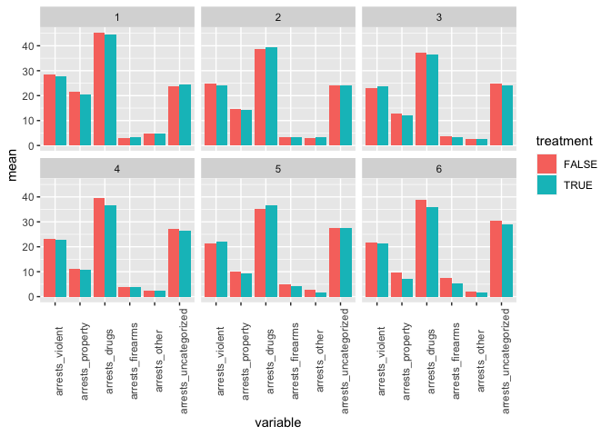

Supplementary document on matching methods
================
Vitaly Lorman
3/25/2021

``` r
library(tidyverse)
```

    ## ── Attaching packages ──────────────────────────────────────────────────────────────────────────── tidyverse 1.3.0 ──

    ## ✓ ggplot2 3.3.0     ✓ purrr   0.3.3
    ## ✓ tibble  3.0.3     ✓ dplyr   0.8.5
    ## ✓ tidyr   1.0.2     ✓ stringr 1.4.0
    ## ✓ readr   1.3.1     ✓ forcats 0.5.0

    ## ── Conflicts ─────────────────────────────────────────────────────────────────────────────── tidyverse_conflicts() ──
    ## x dplyr::filter() masks stats::filter()
    ## x dplyr::lag()    masks stats::lag()

``` r
library(knitr)
library(lubridate)
```

    ## 
    ## Attaching package: 'lubridate'

    ## The following object is masked from 'package:base':
    ## 
    ##     date

``` r
library(scales)
```

    ## 
    ## Attaching package: 'scales'

    ## The following object is masked from 'package:purrr':
    ## 
    ##     discard

    ## The following object is masked from 'package:readr':
    ## 
    ##     col_factor

``` r
library(reshape2)
```

    ## 
    ## Attaching package: 'reshape2'

    ## The following object is masked from 'package:tidyr':
    ## 
    ##     smiths

``` r
library(MatchIt)
library(optmatch)
```

    ## Loading required package: survival

    ## The optmatch package has an academic license. Enter relaxinfo() for more information.

``` r
#library(Zelig)
```

In this document, we keep track of our various attempts at matching and
analysis of balance.

``` r
charges_all<-read.csv("charges_all.csv", row.names=1)
charges_all_long<-read.csv("charges_all_long.csv", row.names=1)
charges_all$date_value<-as.Date(charges_all$date_value)
charges_all_long$date_value<-as.Date(charges_all_long$date_value)
```

### Nearest neighbor matching

``` r
##default
m_nearest.out<-matchit(treatment~arrests_violent+arrests_property+arrests_drugs+arrests_other+arrests_firearms+arrests_uncategorized, data=charges_all, method="nearest")
s_nearest.out <- summary(m_nearest.out, standardize = TRUE)
s_nearest.out
```

    ## 
    ## Call:
    ## matchit(formula = treatment ~ arrests_violent + arrests_property + 
    ##     arrests_drugs + arrests_other + arrests_firearms + arrests_uncategorized, 
    ##     data = charges_all, method = "nearest")
    ## 
    ## Summary of Balance for All Data:
    ##                       Means Treated Means Control Std. Mean Diff. Var. Ratio
    ## distance                     0.5432        0.2880          1.1614     1.2204
    ## arrests_violent             23.6231       26.5059         -0.3895     0.8310
    ## arrests_property            12.3122       18.3004         -0.9657     0.6218
    ## arrests_drugs               38.2624       42.2847         -0.2705     0.6301
    ## arrests_other                2.7873        4.0549         -0.3664     0.8886
    ## arrests_firearms             3.9639        3.1710          0.3289     1.1302
    ## arrests_uncategorized       25.9801       24.3937          0.2096     1.1008
    ##                       eCDF Mean eCDF Max
    ## distance                 0.3013   0.4819
    ## arrests_violent          0.0585   0.1692
    ## arrests_property         0.1113   0.3838
    ## arrests_drugs            0.0445   0.1427
    ## arrests_other            0.0573   0.1924
    ## arrests_firearms         0.0500   0.1591
    ## arrests_uncategorized    0.0330   0.0988
    ## 
    ## 
    ## Summary of Balance for Matched Data:
    ##                       Means Treated Means Control Std. Mean Diff. Var. Ratio
    ## distance                     0.5432        0.3955          0.6723     1.6323
    ## arrests_violent             23.6231       24.7239         -0.1487     0.9499
    ## arrests_property            12.3122       14.9154         -0.4198     1.3902
    ## arrests_drugs               38.2624       39.2786         -0.0683     0.7291
    ## arrests_other                2.7873        3.2935         -0.1463     1.2489
    ## arrests_firearms             3.9639        3.4030          0.2327     0.9941
    ## arrests_uncategorized       25.9801       24.6629          0.1740     1.0140
    ##                       eCDF Mean eCDF Max Std. Pair Dist.
    ## distance                 0.1598   0.3470          0.6723
    ## arrests_violent          0.0238   0.0784          1.0996
    ## arrests_property         0.0522   0.2463          0.7576
    ## arrests_drugs            0.0247   0.0846          1.2652
    ## arrests_other            0.0329   0.1107          0.9372
    ## arrests_firearms         0.0358   0.1281          1.0405
    ## arrests_uncategorized    0.0274   0.0746          1.1042
    ## 
    ## Percent Balance Improvement:
    ##                       Std. Mean Diff. Var. Ratio eCDF Mean eCDF Max
    ## distance                         42.1     -146.0      47.0     28.0
    ## arrests_violent                  61.8       72.2      59.3     53.7
    ## arrests_property                 56.5       30.7      53.1     35.8
    ## arrests_drugs                    74.7       31.6      44.5     40.7
    ## arrests_other                    60.1      -88.3      42.6     42.5
    ## arrests_firearms                 29.3       95.2      28.5     19.5
    ## arrests_uncategorized            17.0       85.5      17.0     24.4
    ## 
    ## Sample Sizes:
    ##           Control Treated
    ## All          1275     804
    ## Matched       804     804
    ## Unmatched     471       0
    ## Discarded       0       0

``` r
#plot(s_nearest.out)

#plot(m_nearest.out,  type = "jitter", interactive = FALSE)
#plot(m_nearest.out,  type = "hist")
#plot(m_nearest.out, type="qq")
```

``` r
m_knearest.out<-matchit(treatment~arrests_violent+arrests_property+arrests_drugs+arrests_other+arrests_firearms+arrests_uncategorized, data=charges_all, method="nearest", min.controls=1, max.controls=3, ratio=1275/653)
```

    ## Warning: Not enough control units for an average of 1.95252679938744 matches per
    ## treated unit.

``` r
s_knearest.out <- summary(m_knearest.out, standardize = TRUE)
  
s_knearest.out <- summary(m_knearest.out, standardize = TRUE)
s_knearest.out
```

    ## 
    ## Call:
    ## matchit(formula = treatment ~ arrests_violent + arrests_property + 
    ##     arrests_drugs + arrests_other + arrests_firearms + arrests_uncategorized, 
    ##     data = charges_all, method = "nearest", ratio = 1275/653, 
    ##     min.controls = 1, max.controls = 3)
    ## 
    ## Summary of Balance for All Data:
    ##                       Means Treated Means Control Std. Mean Diff. Var. Ratio
    ## distance                     0.5432        0.2880          1.1614     1.2204
    ## arrests_violent             23.6231       26.5059         -0.3895     0.8310
    ## arrests_property            12.3122       18.3004         -0.9657     0.6218
    ## arrests_drugs               38.2624       42.2847         -0.2705     0.6301
    ## arrests_other                2.7873        4.0549         -0.3664     0.8886
    ## arrests_firearms             3.9639        3.1710          0.3289     1.1302
    ## arrests_uncategorized       25.9801       24.3937          0.2096     1.1008
    ##                       eCDF Mean eCDF Max
    ## distance                 0.3013   0.4819
    ## arrests_violent          0.0585   0.1692
    ## arrests_property         0.1113   0.3838
    ## arrests_drugs            0.0445   0.1427
    ## arrests_other            0.0573   0.1924
    ## arrests_firearms         0.0500   0.1591
    ## arrests_uncategorized    0.0330   0.0988
    ## 
    ## 
    ## Summary of Balance for Matched Data:
    ##                       Means Treated Means Control Std. Mean Diff. Var. Ratio
    ## distance                     0.5432        0.3554          0.8549     1.0949
    ## arrests_violent             23.6231       25.6252         -0.2705     0.8516
    ## arrests_property            12.3122       16.5240         -0.6792     0.7419
    ## arrests_drugs               38.2624       40.9198         -0.1787     0.6637
    ## arrests_other                2.7873        3.6830         -0.2589     0.9966
    ## arrests_firearms             3.9639        3.3810          0.2418     1.0098
    ## arrests_uncategorized       25.9801       24.6449          0.1764     1.0366
    ##                       eCDF Mean eCDF Max Std. Pair Dist.
    ## distance                 0.2152   0.3470          0.8893
    ## arrests_violent          0.0414   0.1256          1.1637
    ## arrests_property         0.0786   0.2805          1.0574
    ## arrests_drugs            0.0341   0.1153          1.3096
    ## arrests_other            0.0439   0.1480          1.0511
    ## arrests_firearms         0.0371   0.1283          0.9964
    ## arrests_uncategorized    0.0278   0.0808          1.0776
    ## 
    ## Percent Balance Improvement:
    ##                       Std. Mean Diff. Var. Ratio eCDF Mean eCDF Max
    ## distance                         26.4       54.5      28.6     28.0
    ## arrests_violent                  30.5       13.2      29.3     25.8
    ## arrests_property                 29.7       37.2      29.3     26.9
    ## arrests_drugs                    33.9       11.2      23.4     19.2
    ## arrests_other                    29.3       97.2      23.5     23.1
    ## arrests_firearms                 26.5       92.1      25.7     19.3
    ## arrests_uncategorized            15.8       62.6      15.9     18.1
    ## 
    ## Sample Sizes:
    ##               Control Treated
    ## All           1275.       804
    ## Matched (ESS) 1081.26     804
    ## Matched       1275.       804
    ## Unmatched        0.         0
    ## Discarded        0.         0

``` r
#plot(s_knearest.out)
#plot(m_knearest.out,  type = "jitter", interactive = FALSE)
#plot(m_knearest.out,  type = "hist")
#plot(m_knearest.out, type="qq")
```

Does not seem to do
better.

``` r
m_subclass.out<-matchit(treatment~arrests_violent+arrests_property+arrests_drugs+arrests_other+arrests_firearms+arrests_uncategorized, data=charges_all, method="subclass")
s_subclass.out <- summary(m_subclass.out, standardize = TRUE)
s_subclass.out
```

    ## 
    ## Call:
    ## matchit(formula = treatment ~ arrests_violent + arrests_property + 
    ##     arrests_drugs + arrests_other + arrests_firearms + arrests_uncategorized, 
    ##     data = charges_all, method = "subclass")
    ## 
    ## Summary of Balance for All Data:
    ##                       Means Treated Means Control Std. Mean Diff. Var. Ratio
    ## distance                     0.5432        0.2880          1.1614     1.2204
    ## arrests_violent             23.6231       26.5059         -0.3895     0.8310
    ## arrests_property            12.3122       18.3004         -0.9657     0.6218
    ## arrests_drugs               38.2624       42.2847         -0.2705     0.6301
    ## arrests_other                2.7873        4.0549         -0.3664     0.8886
    ## arrests_firearms             3.9639        3.1710          0.3289     1.1302
    ## arrests_uncategorized       25.9801       24.3937          0.2096     1.1008
    ##                       eCDF Mean eCDF Max
    ## distance                 0.3013   0.4819
    ## arrests_violent          0.0585   0.1692
    ## arrests_property         0.1113   0.3838
    ## arrests_drugs            0.0445   0.1427
    ## arrests_other            0.0573   0.1924
    ## arrests_firearms         0.0500   0.1591
    ## arrests_uncategorized    0.0330   0.0988
    ## 
    ## Summary of Balance Across Subclasses
    ##                       Means Treated Means Control Std. Mean Diff. Var. Ratio
    ## distance                     0.5432        0.5308          0.0564     0.9139
    ## arrests_violent             23.6231       23.7453         -0.0165     0.9481
    ## arrests_property            12.3122       13.2916         -0.1579     0.9461
    ## arrests_drugs               38.2624       39.1298         -0.0583     0.7716
    ## arrests_other                2.7873        3.0177         -0.0666     1.3091
    ## arrests_firearms             3.9639        4.2953         -0.1374     0.6136
    ## arrests_uncategorized       25.9801       26.2923         -0.0412     0.9098
    ##                       eCDF Mean eCDF Max
    ## distance                 0.0162   0.0444
    ## arrests_violent          0.0104   0.0386
    ## arrests_property         0.0193   0.0878
    ## arrests_drugs            0.0201   0.0701
    ## arrests_other            0.0220   0.0616
    ## arrests_firearms         0.0219   0.0515
    ## arrests_uncategorized    0.0114   0.0361
    ## 
    ## Percent Balance Improvement:
    ##                       Std. Mean Diff. Var. Ratio eCDF Mean eCDF Max
    ## distance                         95.1       25.1      94.6     90.8
    ## arrests_violent                  95.8      -14.1      82.3     77.2
    ## arrests_property                 83.6      -52.2      82.6     77.1
    ## arrests_drugs                    78.4      -22.5      54.8     50.9
    ## arrests_other                    81.8      -47.3      61.6     68.0
    ## arrests_firearms                 58.2       45.7      56.1     67.7
    ## arrests_uncategorized            80.3       17.4      65.6     63.4
    ## 
    ## Sample Sizes:
    ##               Control Treated
    ## All           1275.       804
    ## Matched (ESS)  356.63     804
    ## Matched       1275.       804
    ## Unmatched        0.         0
    ## Discarded        0.         0

``` r
#plot(s_subclass.out)

#plot(m_subclass.out,  type = "jitter", interactive = FALSE)
#plot(m_subclass.out,  type = "hist")
#plot(m_subclass.out, type="qq")
```

Subclass matching seems to do really
well.

``` r
#m_optimal.out<-matchit(treatment~arrests_violent+arrests_property+arrests_drugs+arrests_other+arrests_firearms+arrests_uncategorized, data=charges_all, method="optimal", ratio=1275/653)
#s_optimal.out <- summary(m_optimal.out, standardize = TRUE)
#s_optimal.out
#plot(s_optimal.out)

#plot(m_optimal.out,  type = "jitter", interactive = FALSE)
#plot(m_optimal.out,  type = "hist")
#plot(m_optimal.out, type="qq")
```

Nope skip this
one\!

``` r
m_cem.out<-matchit(treatment~arrests_violent+arrests_property+arrests_drugs+arrests_other+arrests_firearms+arrests_uncategorized, data=charges_all, method="cem")
s_cem.out <- summary(m_cem.out, standardize = TRUE)
s_cem.out
```

    ## 
    ## Call:
    ## matchit(formula = treatment ~ arrests_violent + arrests_property + 
    ##     arrests_drugs + arrests_other + arrests_firearms + arrests_uncategorized, 
    ##     data = charges_all, method = "cem")
    ## 
    ## Summary of Balance for All Data:
    ##                       Means Treated Means Control Std. Mean Diff. Var. Ratio
    ## arrests_violent             23.6231       26.5059         -0.3895     0.8310
    ## arrests_property            12.3122       18.3004         -0.9657     0.6218
    ## arrests_drugs               38.2624       42.2847         -0.2705     0.6301
    ## arrests_other                2.7873        4.0549         -0.3664     0.8886
    ## arrests_firearms             3.9639        3.1710          0.3289     1.1302
    ## arrests_uncategorized       25.9801       24.3937          0.2096     1.1008
    ##                       eCDF Mean eCDF Max
    ## arrests_violent          0.0585   0.1692
    ## arrests_property         0.1113   0.3838
    ## arrests_drugs            0.0445   0.1427
    ## arrests_other            0.0573   0.1924
    ## arrests_firearms         0.0500   0.1591
    ## arrests_uncategorized    0.0330   0.0988
    ## 
    ## 
    ## Summary of Balance for Matched Data:
    ##                       Means Treated Means Control Std. Mean Diff. Var. Ratio
    ## arrests_violent             22.7159       22.9167         -0.0271     1.0148
    ## arrests_property            13.8295       13.8466         -0.0027     0.9446
    ## arrests_drugs               30.6818       30.9195         -0.0160     0.9714
    ## arrests_other                1.4318        1.3920          0.0115     1.0320
    ## arrests_firearms             2.6364        2.5805          0.0232     0.9307
    ## arrests_uncategorized       21.6250       21.4792          0.0193     1.0059
    ##                       eCDF Mean eCDF Max Std. Pair Dist.
    ## arrests_violent          0.0094   0.0729          0.2790
    ## arrests_property         0.0082   0.0606          0.3646
    ## arrests_drugs            0.0105   0.0758          0.2451
    ## arrests_other            0.0036   0.0398          0.1424
    ## arrests_firearms         0.0049   0.0502          0.2044
    ## arrests_uncategorized    0.0064   0.0379          0.1570
    ## 
    ## Percent Balance Improvement:
    ##                       Std. Mean Diff. Var. Ratio eCDF Mean eCDF Max
    ## arrests_violent                  93.0       92.0      83.9     56.9
    ## arrests_property                 99.7       88.0      92.6     84.2
    ## arrests_drugs                    94.1       93.7      76.5     46.9
    ## arrests_other                    96.9       73.3      93.8     79.3
    ## arrests_firearms                 93.0       41.3      90.2     68.5
    ## arrests_uncategorized            90.8       93.9      80.8     61.6
    ## 
    ## Sample Sizes:
    ##               Control Treated
    ## All           1275.       804
    ## Matched (ESS)   75.74      88
    ## Matched         97.        88
    ## Unmatched     1178.       716
    ## Discarded        0.         0

``` r
#plot(s_cem.out)

#plot(m_cem.out,  type = "jitter", interactive = FALSE)
#plot(m_cem.out,  type = "hist")
#plot(m_cem.out, type="qq")
```

CEM drops too many observations

Try discarding everything outside the convex
hull

``` r
m_hull.out<-matchit(treatment~arrests_violent+arrests_property+arrests_drugs+arrests_firearms+arrests_uncategorized, data=charges_all, method="nearest", discard="both")

s_hull.out <- summary(m_hull.out, standardize = TRUE)
s_hull.out
```

    ## 
    ## Call:
    ## matchit(formula = treatment ~ arrests_violent + arrests_property + 
    ##     arrests_drugs + arrests_firearms + arrests_uncategorized, 
    ##     data = charges_all, method = "nearest", discard = "both")
    ## 
    ## Summary of Balance for All Data:
    ##                       Means Treated Means Control Std. Mean Diff. Var. Ratio
    ## distance                     0.5396        0.2903          1.1532     1.1976
    ## arrests_violent             23.6231       26.5059         -0.3895     0.8310
    ## arrests_property            12.3122       18.3004         -0.9657     0.6218
    ## arrests_drugs               38.2624       42.2847         -0.2705     0.6301
    ## arrests_firearms             3.9639        3.1710          0.3289     1.1302
    ## arrests_uncategorized       25.9801       24.3937          0.2096     1.1008
    ##                       eCDF Mean eCDF Max
    ## distance                 0.2989   0.4757
    ## arrests_violent          0.0585   0.1692
    ## arrests_property         0.1113   0.3838
    ## arrests_drugs            0.0445   0.1427
    ## arrests_firearms         0.0500   0.1591
    ## arrests_uncategorized    0.0330   0.0988
    ## 
    ## 
    ## Summary of Balance for Matched Data:
    ##                       Means Treated Means Control Std. Mean Diff. Var. Ratio
    ## distance                     0.5345        0.3996          0.6243     1.5705
    ## arrests_violent             23.6385       24.7645         -0.1521     0.9293
    ## arrests_property            12.4005       14.8514         -0.3952     1.3326
    ## arrests_drugs               38.2746       40.0554         -0.1198     0.7292
    ## arrests_firearms             3.9030        3.4547          0.1860     0.9494
    ## arrests_uncategorized       25.8791       24.9018          0.1291     0.9734
    ##                       eCDF Mean eCDF Max Std. Pair Dist.
    ## distance                 0.1509   0.3451          0.6244
    ## arrests_violent          0.0241   0.0793          1.0847
    ## arrests_property         0.0482   0.2380          0.7243
    ## arrests_drugs            0.0285   0.1096          1.2035
    ## arrests_firearms         0.0287   0.1171          1.0092
    ## arrests_uncategorized    0.0204   0.0642          1.1029
    ## 
    ## Percent Balance Improvement:
    ##                       Std. Mean Diff. Var. Ratio eCDF Mean eCDF Max
    ## distance                         45.9     -150.4      49.5     27.5
    ## arrests_violent                  60.9       60.4      58.8     53.1
    ## arrests_property                 59.1       39.6      56.6     38.0
    ## arrests_drugs                    55.7       31.6      35.9     23.2
    ## arrests_firearms                 43.5       57.6      42.5     26.4
    ## arrests_uncategorized            38.4       71.9      38.4     35.0
    ## 
    ## Sample Sizes:
    ##           Control Treated
    ## All          1275     804
    ## Matched       794     794
    ## Unmatched     473       0
    ## Discarded       8      10

``` r
#plot(s_hull.out)

#plot(m_hull.out,  type = "jitter", interactive = FALSE)
#plot(m_hull.out,  type = "hist")
#plot(m_hull.out, type="qq")

m_hull_subclass.out<-matchit(treatment~arrests_violent+arrests_property+arrests_drugs+arrests_other+arrests_firearms+arrests_uncategorized, data=charges_all, method="subclass", discard="both")
s_hull_subclass.out<-summary(m_hull_subclass.out, standardize=TRUE)
s_hull_subclass.out
```

    ## 
    ## Call:
    ## matchit(formula = treatment ~ arrests_violent + arrests_property + 
    ##     arrests_drugs + arrests_other + arrests_firearms + arrests_uncategorized, 
    ##     data = charges_all, method = "subclass", discard = "both")
    ## 
    ## Summary of Balance for All Data:
    ##                       Means Treated Means Control Std. Mean Diff. Var. Ratio
    ## distance                     0.5432        0.2880          1.1614     1.2204
    ## arrests_violent             23.6231       26.5059         -0.3895     0.8310
    ## arrests_property            12.3122       18.3004         -0.9657     0.6218
    ## arrests_drugs               38.2624       42.2847         -0.2705     0.6301
    ## arrests_other                2.7873        4.0549         -0.3664     0.8886
    ## arrests_firearms             3.9639        3.1710          0.3289     1.1302
    ## arrests_uncategorized       25.9801       24.3937          0.2096     1.1008
    ##                       eCDF Mean eCDF Max
    ## distance                 0.3013   0.4819
    ## arrests_violent          0.0585   0.1692
    ## arrests_property         0.1113   0.3838
    ## arrests_drugs            0.0445   0.1427
    ## arrests_other            0.0573   0.1924
    ## arrests_firearms         0.0500   0.1591
    ## arrests_uncategorized    0.0330   0.0988
    ## 
    ## Summary of Balance Across Subclasses
    ##                       Means Treated Means Control Std. Mean Diff. Var. Ratio
    ## distance                     0.5387        0.5277          0.0502     0.9030
    ## arrests_violent             23.6553       23.7660         -0.0149     0.9479
    ## arrests_property            12.3836       13.2497         -0.1397     1.0807
    ## arrests_drugs               38.2226       39.1487         -0.0623     0.7653
    ## arrests_other                2.7962        3.0262         -0.0665     1.3211
    ## arrests_firearms             3.9082        4.2613         -0.1465     0.5981
    ## arrests_uncategorized       25.8805       26.2512         -0.0490     0.8911
    ##                       eCDF Mean eCDF Max
    ## distance                 0.0158   0.0443
    ## arrests_violent          0.0104   0.0387
    ## arrests_property         0.0188   0.0841
    ## arrests_drugs            0.0207   0.0701
    ## arrests_other            0.0222   0.0612
    ## arrests_firearms         0.0234   0.0537
    ## arrests_uncategorized    0.0124   0.0369
    ## 
    ## Percent Balance Improvement:
    ##                       Std. Mean Diff. Var. Ratio eCDF Mean eCDF Max
    ## distance                         95.7       26.0      94.8     90.8
    ## arrests_violent                  96.2      -14.1      82.2     77.1
    ## arrests_property                 85.5      -73.8      83.1     78.1
    ## arrests_drugs                    77.0      -21.5      53.4     50.9
    ## arrests_other                    81.9      -48.7      61.2     68.2
    ## arrests_firearms                 55.5       47.1      53.1     66.2
    ## arrests_uncategorized            76.6       19.0      62.6     62.6
    ## 
    ## Sample Sizes:
    ##               Control Treated
    ## All           1275.       804
    ## Matched (ESS)  373.94     795
    ## Matched       1266.       795
    ## Unmatched        0.         0
    ## Discarded        9.         9

``` r
#plot(s_hull_subclass.out)
#plot(m_hull_subclass.out,  type = "jitter", interactive = FALSE)
#plot(m_hull_subclass.out,  type = "hist")
#plot(m_hull_subclass.out, type="qq")
```

Try nearest neighbor with calipers (ok to drop some treatment
units)

``` r
mcal1.out<-matchit(treatment~arrests_violent+arrests_property+arrests_drugs+arrests_other+arrests_firearms+arrests_uncategorized, data=charges_all, method="nearest", caliper=0.01)
scal1.out <- summary(mcal1.out, standardize = TRUE)
scal1.out
```

    ## 
    ## Call:
    ## matchit(formula = treatment ~ arrests_violent + arrests_property + 
    ##     arrests_drugs + arrests_other + arrests_firearms + arrests_uncategorized, 
    ##     data = charges_all, method = "nearest", caliper = 0.01)
    ## 
    ## Summary of Balance for All Data:
    ##                       Means Treated Means Control Std. Mean Diff. Var. Ratio
    ## distance                     0.5432        0.2880          1.1614     1.2204
    ## arrests_violent             23.6231       26.5059         -0.3895     0.8310
    ## arrests_property            12.3122       18.3004         -0.9657     0.6218
    ## arrests_drugs               38.2624       42.2847         -0.2705     0.6301
    ## arrests_other                2.7873        4.0549         -0.3664     0.8886
    ## arrests_firearms             3.9639        3.1710          0.3289     1.1302
    ## arrests_uncategorized       25.9801       24.3937          0.2096     1.1008
    ##                       eCDF Mean eCDF Max
    ## distance                 0.3013   0.4819
    ## arrests_violent          0.0585   0.1692
    ## arrests_property         0.1113   0.3838
    ## arrests_drugs            0.0445   0.1427
    ## arrests_other            0.0573   0.1924
    ## arrests_firearms         0.0500   0.1591
    ## arrests_uncategorized    0.0330   0.0988
    ## 
    ## 
    ## Summary of Balance for Matched Data:
    ##                       Means Treated Means Control Std. Mean Diff. Var. Ratio
    ## distance                     0.4334        0.4328          0.0031     1.0046
    ## arrests_violent             24.6978       24.4544          0.0329     1.0926
    ## arrests_property            14.2373       14.5132         -0.0445     1.2529
    ## arrests_drugs               39.7039       38.6998          0.0675     0.7559
    ## arrests_other                3.2759        3.1379          0.0399     1.6038
    ## arrests_firearms             3.4970        3.5680         -0.0294     0.7378
    ## arrests_uncategorized       24.9249       24.8235          0.0134     0.8282
    ##                       eCDF Mean eCDF Max Std. Pair Dist.
    ## distance                 0.0012   0.0101          0.0039
    ## arrests_violent          0.0076   0.0243          1.0809
    ## arrests_property         0.0114   0.0527          0.6385
    ## arrests_drugs            0.0253   0.0811          1.2454
    ## arrests_other            0.0208   0.0588          0.9556
    ## arrests_firearms         0.0137   0.0426          0.9868
    ## arrests_uncategorized    0.0123   0.0446          1.0800
    ## 
    ## Percent Balance Improvement:
    ##                       Std. Mean Diff. Var. Ratio eCDF Mean eCDF Max
    ## distance                         99.7       97.7      99.6     97.9
    ## arrests_violent                  91.6       52.2      87.0     85.6
    ## arrests_property                 95.4       52.6      89.7     86.3
    ## arrests_drugs                    75.0       39.4      43.2     43.1
    ## arrests_other                    89.1     -300.1      63.7     69.4
    ## arrests_firearms                 91.0     -148.4      72.6     73.2
    ## arrests_uncategorized            93.6      -96.2      62.9     54.8
    ## 
    ## Sample Sizes:
    ##           Control Treated
    ## All          1275     804
    ## Matched       493     493
    ## Unmatched     782     311
    ## Discarded       0       0

``` r
#plot(scal1.out)

#plot(mcal1.out,  type = "jitter", interactive = FALSE)
#plot(mcal1.out,  type = "hist")
#plot(mcal1.out, type="qq")
```

May still need to handle other manually.

## Matching with subclasses

The number of arrests for various offenses is the biggest potential
confounder of charges. We account for this by matching. After
experimenting with different methods of matching, we found the best
balance using subclass matching while discarding a handful of
observations (?) outside the common support of the propensity scores.
This is justified
because…

``` r
m.out<-matchit(treatment~arrests_violent+arrests_property+arrests_drugs+arrests_firearms++arrests_other+arrests_uncategorized, data=charges_all, method="subclass", discard="both")

s.out <- summary(m.out, standardize = TRUE)
s.out
```

    ## 
    ## Call:
    ## matchit(formula = treatment ~ arrests_violent + arrests_property + 
    ##     arrests_drugs + arrests_firearms + +arrests_other + arrests_uncategorized, 
    ##     data = charges_all, method = "subclass", discard = "both")
    ## 
    ## Summary of Balance for All Data:
    ##                       Means Treated Means Control Std. Mean Diff. Var. Ratio
    ## distance                     0.5432        0.2880          1.1614     1.2204
    ## arrests_violent             23.6231       26.5059         -0.3895     0.8310
    ## arrests_property            12.3122       18.3004         -0.9657     0.6218
    ## arrests_drugs               38.2624       42.2847         -0.2705     0.6301
    ## arrests_firearms             3.9639        3.1710          0.3289     1.1302
    ## arrests_other                2.7873        4.0549         -0.3664     0.8886
    ## arrests_uncategorized       25.9801       24.3937          0.2096     1.1008
    ##                       eCDF Mean eCDF Max
    ## distance                 0.3013   0.4819
    ## arrests_violent          0.0585   0.1692
    ## arrests_property         0.1113   0.3838
    ## arrests_drugs            0.0445   0.1427
    ## arrests_firearms         0.0500   0.1591
    ## arrests_other            0.0573   0.1924
    ## arrests_uncategorized    0.0330   0.0988
    ## 
    ## Summary of Balance Across Subclasses
    ##                       Means Treated Means Control Std. Mean Diff. Var. Ratio
    ## distance                     0.5387        0.5277          0.0502     0.9030
    ## arrests_violent             23.6553       23.7660         -0.0149     0.9479
    ## arrests_property            12.3836       13.2497         -0.1397     1.0807
    ## arrests_drugs               38.2226       39.1487         -0.0623     0.7653
    ## arrests_firearms             3.9082        4.2613         -0.1465     0.5981
    ## arrests_other                2.7962        3.0262         -0.0665     1.3211
    ## arrests_uncategorized       25.8805       26.2512         -0.0490     0.8911
    ##                       eCDF Mean eCDF Max
    ## distance                 0.0158   0.0443
    ## arrests_violent          0.0104   0.0387
    ## arrests_property         0.0188   0.0841
    ## arrests_drugs            0.0207   0.0701
    ## arrests_firearms         0.0234   0.0537
    ## arrests_other            0.0222   0.0612
    ## arrests_uncategorized    0.0124   0.0369
    ## 
    ## Percent Balance Improvement:
    ##                       Std. Mean Diff. Var. Ratio eCDF Mean eCDF Max
    ## distance                         95.7       26.0      94.8     90.8
    ## arrests_violent                  96.2      -14.1      82.2     77.1
    ## arrests_property                 85.5      -73.8      83.1     78.1
    ## arrests_drugs                    77.0      -21.5      53.4     50.9
    ## arrests_firearms                 55.5       47.1      53.1     66.2
    ## arrests_other                    81.9      -48.7      61.2     68.2
    ## arrests_uncategorized            76.6       19.0      62.6     62.6
    ## 
    ## Sample Sizes:
    ##               Control Treated
    ## All           1275.       804
    ## Matched (ESS)  373.94     795
    ## Matched       1266.       795
    ## Unmatched        0.         0
    ## Discarded        9.         9

``` r
#plot(s.out)
#plot(m.out,  type = "jitter", interactive = FALSE)
#plot(m.out,  type = "hist")
#plot(m.out, type="qq", interactive=FALSE, subclass=1:6)

matched_data<-match.data(m.out)
#summarise(group_by(matched_data, subclass, treatment), count=n())
```

Let’s look at the distributions of arrests in the different
classes:

``` r
matched_long<-melt(matched_data, id=c("date_value", "subclass", "treatment", "weights", "distance"))

subclass_sum<-matched_long %>%
  group_by(subclass, variable, treatment) %>%
  summarise(mean=mean(value))

subclass_arrest_sum<-subclass_sum[grep("^arrests", subclass_sum$variable),]

ggplot(data=subclass_arrest_sum, aes(x=variable, y=mean, fill=treatment))+
  geom_bar(position="dodge", stat="identity")+
  facet_wrap(~subclass)+
  theme(axis.text.x = element_text(angle = 90))
```

<!-- -->
